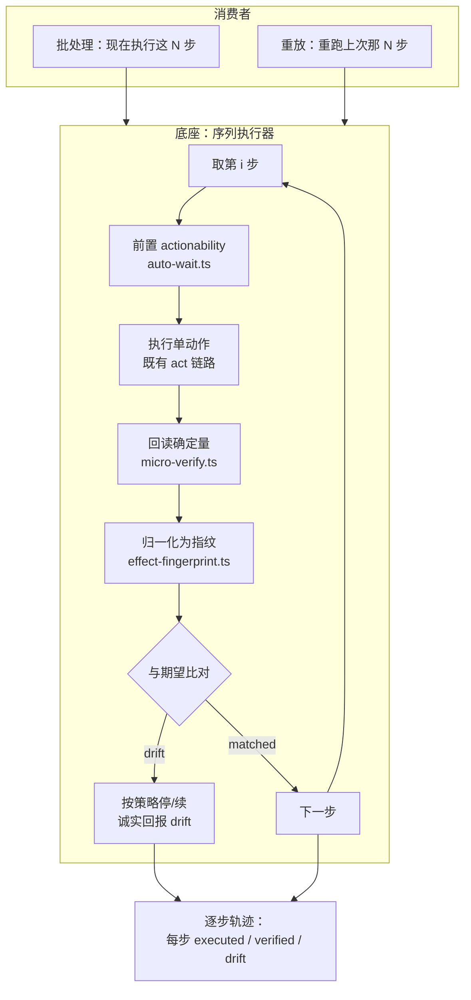

# 实现思路：多步动作序列 + 每步自证（底座）

- 日期：2026-08-13
- 来源：本轮候选面调研 `reports/_eval/next-iteration-2026-08/luna-research.md`；方向关卡已选定「路线 C：建共同底座」
- 状态：**待路线关卡**——本文只到候选路线为止，未选定前不写实施计划、不改代码

## 0. 实现流程图

关键在 S4→S5 那条线：**回读已经在做，归一化只覆盖 click**。底座要做的第一件事是把这根线接满。

## 1. 目标与判据

底座本身不是面向用户的新功能，判据必须落在可测量的中间产物上：

1. **指纹覆盖 1 → 5 种动作**：`click`/`fill`/`type`/`select`/`scroll` 各有 record → verify → drift 的单测；每种至少一个 bench case 走真实浏览器。
2. **每步三态可分**：序列中任一步失败时，调用方能区分「未执行」「已执行但回读失败」「已执行且回读通过」。这是与现有 `fill_form` 的核心差异——后者只返回 `ok/error`，回答不了「点了没有」。
3. **往返次数下降可测**：同一任务，一次序列调用的 MCP 往返数 < 等价的 N 次单动作调用；用 bench 的 `callCount` 直接读。
4. **零回归契约延续**：不带序列/指纹参数时，`act` 行为字节级不变。沿用现有 `fingerprint` 的零开销守卫写法。
5. **字节预算合规**：tools/list 仍在 I15 cap 内，或按仓内惯例（加能力调 cap 不压字符）实测后登记提升理由。

不收「更快」「更好用」这类无法判定的说法。

## 2. 现状勘察

### 已经建好的部分

- **指纹类型早就为 5 种动作留了位置**：`packages/shared/src/effect-fingerprint.ts:16` 的 `action` 联合类型就是 `"click" | "fill" | "type" | "select" | "scroll"`，且 `:21-22` 已声明 `valueAfter`、`scrollAfter` 两个确定量字段。
- **但归一化只有 click**：同文件 `:33-47` 只有 `normalizeClickFingerprint`，靠副作用类别签名判生效（click 没有值可回读）。
- **接线处硬守卫在 click**：`packages/mcp/src/lib/fingerprint-apply.ts:32` 是 `if (action !== "click" || !effect) return {}`；`packages/mcp/src/server.ts:786` 的 `fpActive` 同样双条件卡 `params.action === "click"`。
- **确定量原料只到了一半**（**2026-08-13 订正，见下方补记**）：`select` 与 `scroll` 的成功返回已带确定量，`fill` 与 `type` 没有。

> **订正（写实施计划时实查发现）**
>
> 本节初稿写的是「确定量的原料已经在采，见 `micro-verify.ts:102/120/138/162`」。**这条是错的，两处错**：
>
> 1. **`packages/extension/src/action/micro-verify.ts` 是死代码。** 全仓 grep `microVerify` 只剩它自己的定义
>    与 `action/fallback.ts:4` 的一句注释，**零生产调用方、零测试**。它描述的回读逻辑从不执行。
> 2. **真实回读内联在 `dom.ts` 各动作分支里，且四种动作的成熟度不同**：
>
> | 动作 | 成功返回（`packages/extension/src/handlers/dom.ts`） | 有确定量？ |
> |---|---|---|
> | `select` | `{ success, value: el.value }`（`:1331`）／多选 `{ success, value: selectedNow }`（`:1296`） | **有** |
> | `scroll` | `{ success, moved, scrollTop, scrollLeft }`（`:1447-1453`） | **有** |
> | `fill` | `{ success, focused }`（`:1109`） | **没有** |
> | `type` | `{ success, typed: text.length, path }`（`:816`） | **没有**（只有字符数） |
>
> `fill` 其实在 `:1090` 读了 `el.value`，但只用于 NO_EFFECT 拒绝判据，**没有放进成功返回**——值就在作用域里，
> 少的是一个字段。
>
> **对路线的影响**：阶段一不是「纯接线」。`select`/`scroll` 是接线，`fill`/`type` 要先补回读字段。
> 这抬高了阶段一的工作量，但也说明这件事本身有独立价值：**`fill` 现在返回 `success:true` 却不告诉调用方
> 填进去的到底是什么**，这正是 vortex 一直在灭的「静默假成功」族。
- **前置 actionability 已统一**：`packages/extension/src/action/auto-wait.ts:47-111` 按 visible/stable/obscured/disabled/editable 区分可重试与不可重试。
- **批量执行有现成先例**：`packages/mcp/src/server.ts:589-703` 的 `vortex_fill_form`——串行、失败不中断、结果 `{index, target, ok, error}`（`:673-681`）。**它没有每步 postcondition，也没有 rollback。**
- **响应挂载与 autoRecover 已成形**：`packages/mcp/src/server.ts:920-958`，drift 与 stale-ref 两条信号正交，只在 act 成功且带 effect 后运行。

### 硬约束

- **跨 session artifact 不能靠 MV3**：service worker 内存不可靠，落盘必须在 MCP/Node 侧。设计文档 `docs/superpowers/specs/2026-06-18-verifiable-replay-design.md:108-114` 已经定了这条分层。
- **身份反查有 TTL 与容量**：`packages/mcp/src/lib/observe-render.ts:160-229` 的快照缓存是进程内 `Map`，TTL 5 分钟、上限 20 条。序列一旦跨过这个窗口，`lookupIdentity` 返回 `null`，指纹只能诚实为空。
- **身份键不等于唯一实体**：`role::name::frameId` 多命中时 descriptor 直接抛 `AMBIGUOUS_DESCRIPTOR`（`packages/extension/src/reasoning/descriptor.ts:61-80`）。序列重放踩到重名元素是真实风险。
- **非幂等动作**：click / 提交 / 下载在响应丢失后重试会产生重复副作用。现有传输层重试只按瞬态错误白名单（`packages/mcp/src/client.ts:149-177`），不带业务幂等键。
- **tools/list 预算**：I15 硬上限 10300 B、公开工具 23 个（`packages/mcp/tests/invariants/I15.tools-list-budget.test.ts:152,156`）。
- **page-side 双源约定**：注入函数丢模块作用域，须维护可 import 真源 + 自包含内联副本 + parity 测试。

## 3. 候选路线

### 路线 A：就地扩 `act`，加 `steps[]` 参数

- **切入点**：`packages/mcp/src/server.ts` 的 act 分支，`params.steps` 存在时走序列循环，否则原路。
- **改动落在哪一层**：MCP 编排层为主；extension 侧只需补 4 种动作的指纹归一化。
- **为什么行得通**：复用 act 已有的 target 翻译、actionability、micro-verify 全链路，每步天然穿过既有自证；零开销守卫的写法现成（`server.ts:785-792`）。
- **代价**：`act` 的 schema 会显著变胖，而它已经是 description 最长的工具之一；I15 预算压力最大。act 的语义从「一个动作」变成「一个或多个动作」，对模型的心智负担增加。
- **什么条件下会失效**：如果序列需要步间条件判断（第 3 步依赖第 2 步的返回值），塞进 act 的参数结构会迅速失控。

### 路线 B：新增独立 `vortex_sequence` 工具

- **切入点**：新工具 + 新 dispatch 分支，底座独立成模块，`act` 一行不动。
- **改动落在哪一层**：MCP 新增一个编排模块；extension 侧同样补 4 种动作的指纹归一化。
- **为什么行得通**：`fill_form` 已经证明「MCP 侧串行编排 + 逐条发请求」这条路走得通（`server.ts:589-703`），新工具是它的泛化版加上每步 postcondition。
- **代价**：公开工具 23 → 24，字节预算要实测后调 cap。与 `fill_form` 存在能力重叠，需要明确二者关系（保留 / 标注 / 后续合并）。
- **什么条件下会失效**：如果实际负载里「批量」远多于「重放」，独立工具会显得重；反之如果重放成为主线，它正好是 `vortex_replay` 的天然落点。

### 路线 C：先只补指纹到 5 种动作，序列留到下一轮

- **切入点**：只做 `effect-fingerprint.ts` 的 4 个归一化函数 + 解除 `fingerprint-apply.ts:32` 的 click 守卫 + `server.ts:786` 的守卫放宽。
- **为什么行得通**：确定量原料已在 `micro-verify.ts` 采好，这一步基本是接线加测试。
- **代价**：本轮不产出任何面向用户的能力，价值全部押在下一轮。
- **什么条件下会失效**：如果接线过程中发现 micro-verify 的回读时机与指纹要求的时机不一致（例如异步渲染下 value 尚未落定），这条「纯接线」的假设就不成立，工作量会外溢。

## 4. 取舍分析（**未选定，待关卡**）

- **倾向放弃 A**：不是因为「不优雅」，而是 I15 预算与语义两条具体理由。`vortex_act` 已经是 description 最长的公开工具之一，塞进 `steps[]` 的嵌套结构后字节涨幅难以控制在 cap 内；更要紧的是它会让「act 是单动作」这条已经稳定的契约变模糊，而 Stagehand 官方文档明确把 `act()` 定为单动作、多步不可靠（luna 调研线 1）——这条外部经验与我们的架构判断同向。
- **A 与 B 之间，B 的失效条件更可控**：B 的风险是「可能显得重」，A 的风险是「参数结构失控」。前者可以事后合并，后者要返工。
- **C 是 A/B 的公共前置**：无论最终走 A 还是 B，4 种动作的指纹归一化都必须先做。区别只在于「本轮到此为止」还是「本轮一并把序列做出来」。
- **我的推荐是 B，但把 C 作为 B 的第一阶段**——先接线并用测试锁住，再在其上建序列执行器。这样即使序列部分中途叫停，指纹覆盖的扩大也已经独立落地。

**这一段不是决定。** 按约定，路线由用户在关卡选定。

## 5. 改动地图（以推荐路线 B 为例）

| 模块 | 改什么 |
|---|---|
| `packages/shared/src/effect-fingerprint.ts` | 新增 `normalizeValueFingerprint`（fill/type/select 共用 `valueAfter`）与 `normalizeScrollFingerprint`（`scrollAfter` + 现有 ±5px 容差）；`compareFingerprint` 补对应 drift class |
| `packages/mcp/src/lib/fingerprint-apply.ts` | 解除 `:32` 的 click 硬守卫，改为按 action 派发到对应归一化函数；无回读值时仍诚实返回空 |
| `packages/mcp/src/server.ts` | `:786` 的 `fpActive` 守卫放宽到 5 种动作；新增序列编排分支（参考 `:589-703` 的 fill_form 形态，但每步挂 postcondition） |
| `packages/extension/src/handlers/dom.ts` | `fill` 成功返回补 `value: el.value`（值已在 `:1090` 作用域内）；`type` 成功返回补回读值。`select`/`scroll` 不动，已有确定量 |
| `packages/mcp/src/tools/schemas-public.ts` | 新增 `vortex_sequence` 定义 |
| `packages/mcp/tests/invariants/I15...` | 实测新 payload，按惯例登记 cap 调整理由 |
| `packages/vortex-bench/cases/` | 每种动作一个指纹 case + 一个序列 case（含中途 drift 的红路径） |

数据流：调用方给出 `steps[]` → 每步走既有 act 链路（actionability → 执行 → micro-verify）→ 确定量归一化成指纹 → 与期望比对得 drift → 按策略决定停/续 → 汇总逐步轨迹返回。

## 6. 被证伪的直觉

- **「Phase 1 已经把多动作指纹做完了」——错。** 设计文档列了 5 种动作，我据此以为地基是完整的。实查 `fingerprint-apply.ts:32` 与 `server.ts:786`，两处都硬卡在 click。由 luna 调研指出、我复核确认。
- **「a11y 命名缺口是纯缺陷，应该补」——被削弱。** Playwright v1.62.1 的 `allowsNameFromContent` 不含 `combobox`（我 fetch 源码核实），ARIA 1.2 规定 combobox 的名字 `Name From: author`。无 label 的自定义 combobox 拿不到名字是全生态一致行为，硬合成名字会与 Playwright / Chrome AX / AT 三方分歧。故本轮未把它选为方向。
- **「APC 没有公开 proto，结构还原不出来」——错，已订正。** 见 `reports/external-baseline-2026-08/experimental-domains-probe.md` §2 订正块。
- **「扩展通道够不着 WebMCP/APC」——错，已实测推翻。** 见同文件 §2.5。挡路的是仓内自己的 `assertEnableable` 白名单，不是浏览器。

## 7. 待验证假设

| 假设 | 状态 | 实施前必须做什么 |
|---|---|---|
| ~~micro-verify 的回读时机与指纹要求的时机一致~~ | **已推翻** | micro-verify 是死代码；真实回读在 dom.ts 内联，见 §2 订正 |
| 同步回读的 value 在受控组件下已落定 | **推测** | 拿 React 受控 input 实测：`fill` 后同步读 `el.value` 是否已是最终值（框架可能异步重渲染回滚） |
| 快照 5 分钟 TTL / 20 条容量够序列用 | **推测** | 按典型序列长度与耗时估算，必要时实测跨 TTL 的行为 |
| 序列能显著降低往返次数 | **推测** | 用 bench `callCount` 对同一任务做序列 vs N 次单动作的对照 |
| 新增一个公开工具后仍在 I15 预算内 | **推测** | 写完 schema 后实测 payload 字节，按惯例登记 |
| 重名元素在序列重放中的误命中率可接受 | **未测** | 需要构造重名 fixture 实测，这是 luna 列出的核心证伪条件 |
| 日常工作流里「重复跑同一套步骤」的占比 | **未知** | 只有用户能回答；它决定重放消费者的价值兑现 |
