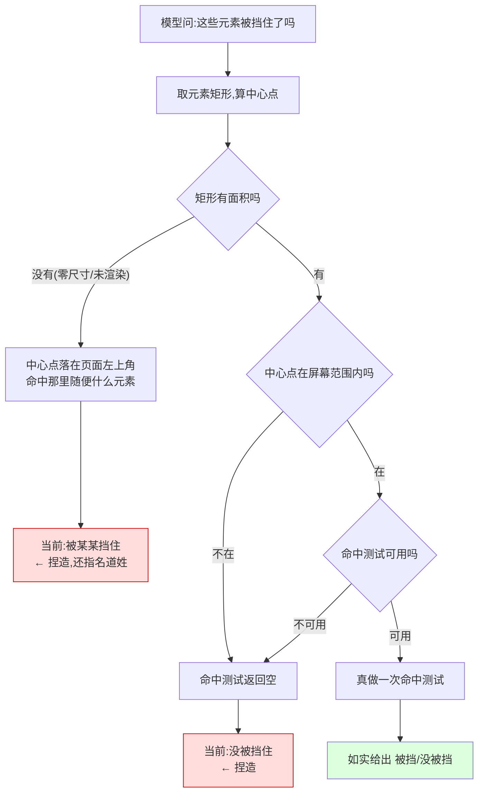

# 深 DOM 性能压测 —— 实现思路

> 触发：`reports/_review/luna-final-review.md:12` 终审留的低优先级补强项「在后续性能测试加入深 DOM 压测和阈值」。
> 勘察 2026-08-20，Chrome 151.0.0.0。语料：本地构造 40007 节点 / depth 30；真站校准 en.wikipedia.org、github.com。
> 与终审作者（Luna）的辩论记录见 `reports/_review/luna-deepdom-debate.md`。

## §-1 一页纸

**改什么** —— 建一套可重复的大页面压力语料和成本账；并修掉工具在「判断不了某个元素有没有被别的东西挡住」时，仍然给出笃定答案的问题。

**为什么现在改** —— 上一轮终审放行时留了句「现有实测只代表一个站点」。这次把最坏情况真造出来测了，结论和当初的猜测相反：**当初被点名担心的那段代码，在真实站点上根本跑不满**；而没人怀疑的那一项，在一个主流站点上有四分之一的元素拿到了错误答案。

**改完谁会感觉到什么不同** —— 用工具看页面的模型，问「这个元素被挡住了吗」，在测不了的时候会明确得到「测不了」，而不是一个听起来很确定、实际是编的答案。现在最糟的一种是：工具会指名道姓说「它被某某元素盖住了」，而那个元素只是恰好待在页面左上角。人这边多一份成本账。

**本次明确不解决什么** —— 不追求把大页面耗时压到某个目标；不改元素扫描算法；不给对比度计算加深度上限（那会让它开始编造数字）；不把压测接进阻断门；不改遮挡判断穿不穿组件内部边界这件事（见 §3 附注，单独一轮）。

**不改会怎样** —— 错误答案继续存在，而**它比慢危险**：慢看得见，假的确定性看不见。已经有过一次真实代价——一份评测报告里 147 个元素全被报成「被同一个东西挡住」，当时的结论是「这个功能在本场景没用」，缺陷被当成了能力不足。

**影响面多大、风险在哪** —— 改动集中在三行代码的取值上，但它属于对外返回内容，取值会从「是/否」变成「是/否/测不了」。已经在读这个字段的调用方，如果写的是二选一判断，需要跟着调整——而且要提醒：写成「不是被挡住就当作可以点」的调用方，加了第三种取值后**不会自动变安全**，仍会走进同一分支。另外压测数字天然抖动，同一调用重复十次最快到最慢差 1.4 倍，所以任何合格判据不能建立在墙上时钟耗时上。

## §0 实现流程图

## §0.5 问题重定义

**表象**：终审说「无上限祖先上溯不能证明任意站点最坏情况」，处方是补深 DOM 压测和阈值。

**真正失效的机制**：不是那条循环，也主要不是性能。真站实测下那条循环走 3–10 步就停（github.com 3 步、en.wikipedia.org 10 步、gamma.app 12 步），是整条链路里最便宜的一段。终审的判断是**从代码长相推的**——看见没有上界的 `for` 就标风险；而真正出问题的 `document.elementFromPoint` 长成一次普通函数调用，看不出内部是整棵渲染树的命中测试，更看不出它在拿不到结果时会被调用方压成一个确定值。

**约束逐条分类**：

| 约束 | 分类 | 依据 |
|---|---|---|
| 要报真实对比度就必须找到第一个绘制背景的祖先，不能按深度截断 | **物理必然** | 截断即捏造，而这个能力存在的理由正是纠正捏造（`vortex_v3_0_0_style_investigation`：对比度五态修掉真站 46% 捏造数字） |
| `getComputedStyle` 需要 style 计算 | **物理必然** | 浏览器 API 性质 |
| `elementFromPoint` 是整棵渲染树的命中测试，成本随页面规模增长 | **物理必然**（但见下方收窄） | 本语料本浏览器实测 2k/10k/40k → 3.4/19.3/116.5ms（50 元素）。**不作为跨浏览器普遍规律**——此处采纳 Luna 的收窄 |
| `elementFromPoint` 对视口外坐标提前返回 `null` | **物理必然** | 规范行为，实测 0.007ms |
| 拿到 `null` 判 `occluded:false` | **历史习惯** | `query.ts:657` 一个 `!!` 把「没测到」压成「测到没遮挡」 |
| 零面积元素照样拿中心点去命中测试 | **历史习惯** | 零面积矩形的中心点不代表该元素，命中结果是噪声 |
| 探针经 `executeScript({func})` 注入，用不了 page-side 模块 | **物理必然** | 注入丢模块作用域（`vortex_page_side_func_inline_gotcha`），所以 query 只能用裸 `elementFromPoint` 而非全仓通用的下钻版 |
| 每个元素独立上溯、不共享祖先结果 | **历史习惯** | 但实测无收益，见 §6 |

**反事实**：去掉「不可判定压成确定值」这两条历史习惯，问题消失——而且**零额外成本**，视口外那一路本来就 0.007ms，零面积那一路本来就该跳过。去掉「不共享祖先」，只在 depth 500 的病态页面有收益，真站无感，不动。

**本次修根因还是修症状**：修根因。根因是「不可判定被伪装成确定值」，与对比度五态、与 observe 的 `occlusion check unavailable` 是同一套原则。性能部分只给成本账，不追耗时目标。

## §1 目标与判据

1. 存在可重复的压测语料与命令，产出**逐维度成本归因表**，重跑结论稳定（不因缓存冷热翻转次序）。
2. `occluded` 三态：测到被遮挡 `true` / 测到未被遮挡 `false` / 不可判定 `null`；`occludedBy` 只在 `true` 时出现。不可判定判据覆盖零面积、视口外、API 不可用三种。
3. 契约测试锁三态并**经变异验证**——改实现必须有指定测试转红，靶子清单见 §7。
4. 判据**不建立在端到端墙钟上**（实测同调用 10 次 96–132ms，1.4×）。压测用页内阶段计时 + 确定性计数（命中测试次数、上溯步数、匹配元素数）。
5. 不引入对比度深度上限，不做祖先样式缓存。

## §2 现状勘察

**遮挡判断的三行**在 `packages/extension/src/handlers/query.ts:656-658`：`const topEl = typeof document.elementFromPoint === "function" ? document.elementFromPoint(cx, cy) : null;` 然后 `item.occluded = !!(topEl && topEl !== el && !el.contains(topEl));`，`occludedBy` 仅在为真时附带。`inViewport` 在紧邻的 `:652`，容差 `TOL = 2` 定义在 `:521`。

**四种输入塌缩成错误的确定答案**（实测）：

| 情形 | 真相 | 当前输出 |
|---|---|---|
| 视口外 | 没测（返回 `null`） | `occluded: false` |
| `elementFromPoint` 不可用 | 能力缺失 | `occluded: false` |
| 零尺寸元素 | 无面积，谈不上遮挡 | `occluded: true` + 假 `occludedBy` |
| `display:none`（bbox 全 0） | 根本没渲染 | `occluded: true` + 假 `occludedBy`，且 `inViewport: true` |

**注意最后两种否掉了「用 `inViewport` 当判据」**：bbox 全 0 时 `0 >= -2 && 0 <= vw+2` 全部成立，`inViewport` 是 `true`。

**真站发生率**：github.com 前 50 个 `a,button,span`，**13 个（26%）** 落入零面积情形，全部报同一个假凶手 `occluded=true, occludedBy=span.progress-pjax-loader`——它们 bbox 都在 (0,0)，那个 loading 条正好在左上角。历史已撞到过：`reports/_dogfood/newbeta-2026-07-04/anomalies-r4.json:57,103` 记 63 个和 147 个元素全部 `bbox=0,0,0,0 occluded`，当时结论是「此 mode 在本场景无信息」——缺陷被当成能力不足。

**项目内已有正确做法**：`packages/mcp/src/lib/observe-render.ts:432` 会明确输出 `occlusion check unavailable → visible/occludedBy not judged in this frame`。所以三态不是新发明，是让 query 与 observe 一致。点击路径同样已做对：`packages/extension/src/page-side/hit-ownership.ts:132` 把 `null` 作为独立 blocker `elementFromPoint=null`，`packages/extension/src/adapter/native.ts:85` 与 `packages/extension/src/action/auto-wait.ts:73` 各有专门分支——**只有 query 把它压成了 `false`**。

**对比度的无上限上溯**在 `query.ts:728-744`，`for (let a = el.parentElement; a; a = a.parentElement)`，碰到背景图或不透明背景即 `break`。对照 `query.ts:663` 的裁剪祖先上溯写的是 `j < 12` 有界。

**成本归因实测**（50 元素）：

| 项 | 2k 节点 | 10k 节点 | 40k 节点 |
|---|---|---|---|
| `elementFromPoint`（遮挡） | 3.4ms | 19.3ms | **116.5ms** |
| 对比度无上限上溯 | — | — | 2.4ms |
| 裁剪祖先上溯（有界 12） | — | — | 0.8ms |
| `getBoundingClientRect` | — | — | 0.1ms |
| 元素扫描 `queryAllDeep` | 1.7ms | 3.0ms | 15.2ms |

对比度深度敏感性（整链无绘制背景）：depth 12 → 2.0ms，50 → 6.4ms，200 → 23.4ms，500 → 59ms。最近祖先有底色时 **0.1ms**。

**真站校准**（否掉「40k 是真实上界」）：

| 站点 | 节点数 | 最大深度 | contrast 实际上溯步数 | 50 次命中测试 |
|---|---|---|---|---|
| en.wikipedia.org | 5413 | 21 | 10 | — |
| github.com | 2391 | 37 | 3 | 7.8ms |
| 构造语料 | 40007 | 30 | 走满 | 46ms |

**端到端**（40k 语料，经 hub `packages/hub/src/http-routes.ts:96`）：`geometry` 140ms / `contrast` 111ms / `typography` 89ms / `text` 94ms，空转基线约 88ms；噪声 n=10 为 96–132ms。

**可复用机制**：`packages/vortex-bench/src/` 已有 fuzz 语料生成与 manifest ground-truth 约定，压测语料沿用；维度自陈 `dimensions.<名>.available` 已在上一轮落地。

**公开契约现状**：`occluded` 未出现在 `packages/mcp/src/tools/schemas-public.ts`，语义只体现在 `packages/extension/tests/element-shaping.test.ts:114,118-122` 与 `packages/extension/tests/query-geometry.test.ts:43,64,76`。整形层 `packages/extension/src/lib/element-shaping.ts:23` 的键表含 `occluded`，`pick` 条件是 `!== undefined`，因此 `null` 理论上会保留——但 `errors` 曾被剥过，此条必须由输出级测试锁死而非靠读代码。

## §3 候选路线

**路线 A —— 只建压测，不动实现**（bench 层）
沿用 `vortex-bench` 生成语料，产出归因表落盘为基线，只记录不阻断。
*行得通*：字面兑现终审要求，回归有对照。
*代价*：已确认的错误答案原地不动——建了仪表盘，指针指着红区却不修。业务侧：模型继续在四分之一的元素上收到假的遮挡结论，据此等待或放弃，失败在日志里表现为「点了没反应」，排查成本落到使用者身上。
*失效条件*：阈值若定在端到端墙钟上，1.4× 噪声让它 flaky（`vortex_observe_class_name_noise` 踩过）。

**路线 B —— 修不可判定语义 + 建压测锁住**（算法/语义层）
`occluded` 改三态，判据为「零面积 或 中心点视口外 或 API 不可用」；同时建 A 的压测语料。
*行得通*：判据所需信息全在原地（`query.ts:652` 附近的 rect），零额外成本；项目内已有 observe 与点击路径两处先例和测试范式。
*代价*：取值域变更属破坏性变更，需 CHANGELOG 与契约测试。业务侧：模型会看到更多「测不了」，短期像能力变弱，实为把隐藏的不确定性显式化。
*失效条件*：调用方写 `if (!occluded)` 时 `!null` 仍为真，行为不变——即失效于「调用方根本不区分」，故变更说明必须点名这一点。

**路线 C —— 加成本自陈**（协议/返回体层）
返回体加成本字段，超预算截断并自陈。
*行得通*：契合「诚实表征层」定位（`vortex_competitive_analysis_2026_06`）。
*代价*：撞 I15 tools/list 预算（上轮已抬到 11750，余量 107B）；不修错误答案。
*失效条件*：成本字段若用墙钟耗时，1.4× 噪声会让模型据抖动摇摆决策。

**附注：第五处缺陷，本轮不做。** `query.ts:656` 用裸 `document.elementFromPoint`，不下钻 open shadow root；全仓其它路径都下钻（`packages/extension/src/page-side/shadow-walk.ts:76-79`、`packages/extension/src/handlers/observe.ts:2502-2505`、`packages/extension/src/lib/hit-probe.ts:50-54`、`packages/extension/src/adapter/cdp.ts:166`）。实测 open shadow root 内一个完全没被遮挡的按钮被报成 `occluded: true, occludedBy: "host"`。成因是物理约束：探针经 `executeScript({func})` 注入丢模块作用域，用不了那些模块，只能内联。不并入本轮的理由是修法性质不同——1–4 是「不给答案」，这一处是「改命中测试本身」，会改变已有 true/false 的取值而不只是新增 `null`，回归面更大。

## §4 取舍与选定

**选定 B，并把 A 的压测产出物完整包含进来。** 此选择已与终审作者辩论并达成一致（`reports/_review/luna-deepdom-debate.md`）。

放弃**纯 A**：实测已回答了「有没有问题」——有，但不是终审猜的那个。在已知一处会给错答案时只建仪表盘，等于用「补了压测」这个动作掩盖「没修已发现缺陷」。

放弃 **C 作为本轮主线**：I15 余量仅 107B，而它解决的是「模型自己规避慢」——慢在真站实测根本不成立（github.com 命中测试 50 次 7.8ms）。C 只在成本字段用确定性计数而非耗时时才成立，留作独立一轮。

## §5 改动地图

`packages/extension/src/handlers/query.ts` 的 geometry 判断（`:656-658`）取值改三态；`packages/extension/src/lib/element-shaping.ts:23` 确认 `null` 不被剥离；`packages/extension/tests/query-geometry.test.ts` 与 `packages/extension/tests/element-shaping.test.ts` 补三态用例并做变异验证；`packages/mcp/src/tools/schemas-public.ts` 视 I15 预算决定是否点明三态；CHANGELOG 记破坏性变更并点名 `!occluded` 不安全。压测部分在 `packages/vortex-bench/` 下新增语料生成与归因命令及落盘基线。数据流不变——模型问、探针注入采集、按维度整形回传，只是「测不了」第一次被表达出来。

## §6 被证伪的直觉

1. **「50 个元素共享祖先会重复计算，是额外风险」**（终审原文）——实测共享与独立深链耗时几乎相同：depth 12 为 2.0 vs 1.8ms，depth 500 为 59 vs 57.1ms。成本只与总步数线性相关。推论「加祖先缓存」只在共享场景有收益，而共享场景不是瓶颈。**收窄**（采纳 Luna）：这不证明缓存永远无收益，只说明本轮没有理由做。
2. **「无上限上溯是最坏情况风险点」**——真站第一层或第三层即 `break`：github.com 3 步、en.wikipedia.org 10 步。走满需要整条链含 `body`/`html` 全无绘制背景且深度上百。
3. **「首次调用 1.87s 说明大 DOM 有巨额一次性 layout」**——这个数字是我用 `curl -o /dev/null` 丢弃响应体测出来的，那次请求实际落在**另一个标签页**（1762 节点、无匹配元素），我在给一个错误响应计时。补 `tabId` 后为 140ms。**丢弃响应体等于在给错误响应计时。**
4. **「`elementFromPoint` 成本随 DOM 规模一致增长」**——只对视口内坐标成立；视口外提前返回 `null`，是视口内的 1/120。
5. **「40k 节点是有代表性的上界」**——真站校准后否掉：wikipedia 5413、github 2391。40k 是压力点，不是上界。
6. **「用 `inViewport` 就能当不可判定判据」**（我自己第一版的提案，也是 Luna 第一轮认可的）——零尺寸和 `display:none` 元素 bbox 全 0，`inViewport` 反而是 `true`，只用它会把发生率最高的那一类原样漏过。

## §7 待验证假设

| 假设 | 状态 | 谁怎么确认 |
|---|---|---|
| 仓库内没有把 `occluded` 当二值用的下游 | **已实查**（Luna 第一轮逐点核过：生产写入点仅 `query.ts:657-658`，其余为测试与 observe 自有路径） | 已闭合；但外部 MCP 调用方不受源码搜索覆盖，需在变更说明点名 |
| `null` 不会被整形层或序列化剥掉 | **推的**（`pick` 条件是 `!== undefined`，读代码成立） | 我写输出级测试断言 `occluded: null` 出现在最终返回体，并做变异验证——`errors` 曾被剥过，不接受读代码结论 |
| 不可判定判据无第五种情形 | **已闭合** | Luna 第二轮补第四种（`elementFromPoint` 抛异常），已实现为局部 `try/catch`，不连坐同维其余字段 |
| `inViewport` 对 `display:none` 报 true 是否一并修 | **已闭合，修了** | 全仓 `inViewport` 生产消费方读的都是 observe 自己的字段（`mark-overlay.ts:55`、`observe-render.ts:530,704`），query 这一路无生产消费方 |
| 压测归因次序稳定 | **已闭合** | `vortex-bench perf` 落盘 `reports/perf/`，次序在差距小于抖动时以 `~` 并列 |
| 点击路径有无同源缺陷 | **已实查，无** | `hit-ownership.ts:132` 把 `null` 作独立 blocker，不压成 false |
| shadow 不下钻是否该并入本轮 | **已定，不并入** | Luna 判为 **P1 单独一轮**（不是低优先级搁置）：它改的是已有 `true/false` 的取值，不只是新增 `null`，回归面不同 |

## §8 实际结果

**修复前后**（github.com 前 50 个 `a,button,span`，真浏览器实测）：13 个零面积元素从
`occluded: true, occludedBy: span.progress-pjax-loader` 变为 `occluded: null` / `inViewport: false` / 无 `occludedBy`。
`bbox [0,0,1,1]` 那个**有面积**的元素仍给出真实结论 `occluded: true` —— 修复没有过度扩大成「坐标在原点就不判」。

**变异验证 11/11 全部转红**，无死条件。过程中删掉两处证明不承重的条件：
`typeof document.elementFromPoint === "function"`（有 `try/catch` 时改它不转红）和中心点视口判断
（视口外浏览器自己返回 `null`，实测 30/30）。

**shadow 下钻（后续一轮，`440e3df`）**：命中测试改用内联 `deepElementFromPoint`，归属改用内联
`composedContains`（与 `packages/extension/src/page-side/hit-ownership.ts:65` 同语义）。受控 fixture 真浏览器实测：
open shadow 内自渲染按钮 `true, occludedBy:"host"` → `false`；被同 shadow 浮层盖住的那个
`occludedBy` 由 host 变为真正的浮层。变异 6/6 转红。

根因不是"没人想到"：`CHANGELOG.md:403` 记的 2026-05-27「读路径穿 open shadow 族 K」
（`dad3d8e`+`4cdea1c`）扫了 `observe.ts` / `content.ts` / `capture.ts`，**漏了 `query.ts`**。

**只下钻还不够，真站上没闭合**：shoelace.style 上 59 个 shadow 内元素判定一个没变。
原因有两层——那页有个默认打开的演示对话框真遮住了 47 个（**这一层我第一次归因错了**，
把全部 59 个都算成 slot 重定向，实际只有 7 个是）；剩下的才是 **slot 重定向**：组件可见内容来自
`<slot>`，点落在 slotted 的 light-DOM 上时 `shadowRoot.elementFromPoint` 按规范重定向回 host
（下钻链呈 `sl-button → sl-button` 自环），最终命中是目标自己的 composed 祖先。

**祖先命中语义（Luna 第三轮判定，选 C）**：报 `null`。祖先命中只证明浏览器没返回更深的独立
命中元素，证明不了目标被挡住（`true` 是假阳性），也证明不了目标没被裁剪或覆盖（`false` 是假阴性，
调用方会当成已确认可点）。与 `classifyHit` 的 ancestor 分支刻意分叉：那边答「事件到不到得了」，
这边答「上面有没有东西」。

**闭合后的真站数字**（shoelace.style，关掉演示对话框，47 个 shadow 内可测元素）：

| | 改前 | 改后 |
|---|---|---|
| `occluded: true` | **47（全部）** | 8（真遮挡） |
| `occluded: false` | 0 | 9（下钻找到目标自己） |
| `occluded: null` | 0 | 30（祖先 / slot 重定向） |

**83%（39/47）是假的「被遮挡」。** 对照 github.com（页面无 open shadow）：祖先命中 0 个，
判定与改前完全一致 —— 这条改动只在该起作用的地方起作用。

**压测首轮**（`vortex-bench perf --repeats 3`，Chrome 151，结构真值 4/4 全绿）：

| 语料 | 节点 | 成本次序 |
|---|---|---|
| realistic-2k | 2000 | 全部并列（小页面分不出） |
| realistic-10k | 10002 | **geometry** > 其余并列 |
| stress-40k | 40002 | **geometry** > 其余并列 |
| pathological-deep（深 500 无绘制背景） | 2000 | **contrast** > 其余并列 |
| shadow-breadth（200 并列 host） | 4002 | 全部并列 |
| shadow-nested（20 链 × 嵌 6 层） | 2002 | 全部并列 |

**shadow 语料的价值不在耗时次序而在确定量**（50 个元素的命中测试次数）：

| 语料 | 命中测试 | 祖先上溯步数 |
|---|---|---|
| 纯 light DOM 各形状 | 50 | 50 / 1650 / 25150 |
| shadow-breadth（nest 1） | **100** | 50 |
| shadow-nested（nest 6） | **350** | 50 |

每嵌一层 shadow，每个元素就多一次命中测试；nest 6 = 7 倍，而一次命中测试在 4 万节点上约 0.85ms。
上溯步数两条 shadow 语料都是 50（每元素 1 步）—— 因为 `contrast` 走 `el.parentElement`，
**它不跨 shadow 边界**，shadow 内元素够不到 host 的背景色。这是与遮挡同类、但在另一个维度上的缺口。

**已修（后续一轮）**：`contrast` 上溯改走 composed tree。背景由渲染树决定，而渲染树就是
composed tree，拿 light DOM 树去找渲染背景是用错了树。实测 shoelace.style 706 个 shadow 内元素，
报"无绘制背景"的从 246 个（35%）降到 **0**，原本能算的 460 个一个没变。同时去掉
`composedContains` 的 `hops < 64` 上限 —— 它在超 64 层的深 DOM 上会把祖先命中退化成别处命中。
语料真值随之更新：`shadow-nested` 改为不上色，上溯步数由 50 变 **950**（19/元素），
这次是语料自己把行为变更钉住的。

最后一行印证了终审坚持保留的表述：无上限上溯的病态最坏情况**真实存在**，只是真站走不满
（github.com 3 步、en.wikipedia.org 10 步，而语料里走满是 25150 步）。
