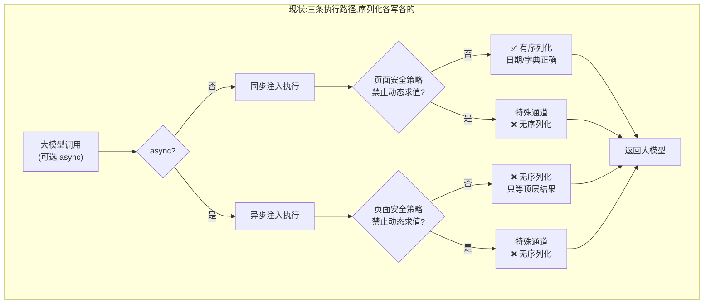
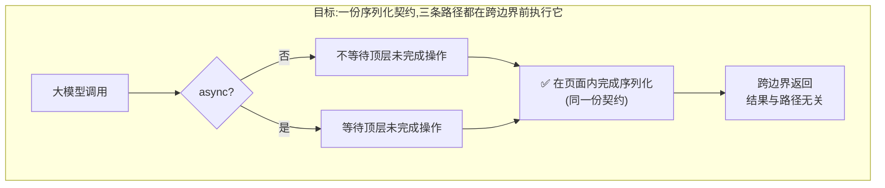

# evaluate 返回值失真 —— 实现思路

## -1. 一页纸

**改什么。** 大模型让浏览器跑一段自己写的代码、把结果取回来时，结果有可能是假的：
真实的日期、字典、集合会变成一个空对象，而调用方看不出任何异常。本次要让取回来的
结果要么真实，要么明确自陈"这个值取不回来"，不再出现第三种情况——看起来正常但内容是编的。

**为什么现在改。** 这不是理论风险。它在本月的真实调用日志里已经发生：一次调用返回了一个
字段齐全、看起来完全正常的结果，其中一项的真实内容是一个尚未完成的网络请求，
却被表示成了空对象——调用方据此认为"服务器返回了空"。
更严重的是，在安全策略严格的网站上（GitHub 是其中之一），这个问题**覆盖所有值类型**，
连日期都取不回来——而我们过去两年为此写的修复，在这类网站上一行都没生效。

**改完谁会感觉到什么不同。** 让浏览器跑代码取数据的大模型，不会再拿到编造的空结果。
取不回来的值会带一句说明，告诉它该怎么改写代码。同一段代码在不同网站上会给出同样的结果——
今天不是这样：同一个调用在普通网站和 GitHub 上会给出两种不同的答案。

**本次明确不解决什么。** 不改变大模型写代码的方式，不新增工具，不解决"页面本身就返回空对象"
这种情况（那是真实数据，必须原样返回）。也不处理另一个执行入口（供内部调用、当前无人使用），
只会明确它的归属。

**不改会怎样。** 编造的数据会继续流向大模型的推理。它比报错更危险——报错会让人重试，
编造的空值会被当成事实用下去。已经有过先例：一份评测报告里的结论建立在这类假数据上。

**影响面多大、风险在哪。** 改动集中在一处，但会**改变一个已有的返回行为**：
在安全策略严格的网站上，一段返回"尚未完成的操作"的代码，过去会得到操作完成后的结果，
之后会得到一句"这个值没法直接取回"。这是把该网站上的行为修正到其他网站早已具备的样子，
但依赖旧行为的调用方会看到变化，需要写进变更记录。另有一处风险：安全策略严格的网站
只能通过一条特殊通道执行代码，而**这条通道目前不支持页面内嵌的子框架**——
如果把所有执行都改走它，子框架里的代码就跑不了了。这决定了候选路线之间的取舍。

## 0. 实现流程图

## 0.5 问题重定义

**表象与真正失效的机制不是一回事。** 表象是"一种值变成了空对象"；真正失效的是
**取回结果这件事有三条各自独立的实现，其中只有一条装了序列化**。上一轮我按表象修，
在唯一装了序列化的那条路径上补了一个值类型分支——修完立刻冒出同类的第二批、第三批，
这正是治标信号。

三条路径与它们的序列化落点：同步注入执行在 `js.ts:289`，其序列化内联在 `js.ts:321`；
异步注入执行在 `js.ts:452`，它对结果只做 `js.ts:520` 的一次顶层等待，**没有任何序列化**；
安全策略严格时的特殊通道在 `js.ts:116`，它把结果原样返回（`js.ts:169`）。

**约束逐条分类：**

| 约束 | 分类 | 依据 |
|---|---|---|
| 注入页面执行的代码必须自包含，不能引用模块作用域 | **物理必然** | 浏览器注入时按源码文本传递，模块闭包丢失（`js.ts:315-321` 注释记录了此前的线上回归） |
| 特殊通道当前只能作用于主框架 | **物理必然（在不补定位能力的前提下）** | 子框架需按执行上下文定位，当前未实现（`js.ts:432` 注释） |
| 三条路径各写各的序列化 | **历史习惯** | 修复是逐次叠加的：序列化最早只加在同步路径，后两条从未回补 |
| 结果先跨边界、再在扩展侧归一化 | **历史习惯** | `js.ts:210` 的函数为此而写，但它**零生产调用点**，特殊通道在 `js.ts:169` 直接返回原值 |
| 特殊通道固定等待顶层未完成操作 | **历史习惯** | `js.ts:137` 写死，与同步路径语义相反，且无人显式选择过 |
| 序列化按值的品牌分类 | **历史习惯** | 白名单式，未命中即落兜底，兜底对"无可枚举属性"的值一律产出空对象 |

**去掉历史习惯后问题是否还在。** 不在。若三条路径共用同一份序列化、且都在跨边界前执行它，
那么"某个值类型没覆盖"只需改一处，也不可能出现上一轮那种"改了一半死代码却自以为验证过了"。
所以真正要解决的是**序列化没有单一真源**，而不是白名单缺了几个类型。

**本次修根因。** 不是修症状。

## 1. 目标与判据

1. 对同一段用户代码，普通网站与安全策略严格网站返回**相同结构**；唯一允许的差异是
   "是否等待顶层未完成操作"，且该差异由调用参数决定、与网站无关。
2. 同步与异步两种模式对嵌套的未完成操作给出相同的自陈标记。
3. 页面真实返回的空对象仍然是空对象（反向判据，防止把合法空值误报成取不回）。
4. 每条路径的验收必须证明**该路径确实被执行到**，而不只是结果对——上一轮的教训是
   结果对可能因为走了另一条路径。
5. 取不回的值所附的说明，必须指向一条真正能拿到结果的做法。

## 2. 现状勘察

**对外只有一个入口，按参数分成两条动作。** `packages/mcp/src/tools/dispatch.ts:88`
依 `async` 分派到两个不同的处理器，此后二者再无共享代码。

**同步路径是唯一装了序列化的一条。** 处理器在 `js.ts:289`，序列化以内联函数形式写在
`js.ts:321`，覆盖日期、错误、字典、集合、节点列表、定型数组，其余落 `for...in` 兜底。

**异步路径完全没有序列化。** `js.ts:452` 的处理器注入的函数，对结果只做一次顶层等待
（`js.ts:520` 的 `return { result: await promise }`），此后直接跨边界。实测佐证：
同一个字典，同步返回 `[[1,"a"],[2,"b"]]`，加 `async` 返回 `{}`。

**特殊通道把结果原样返回。** `js.ts:116` 的实现向浏览器请求按值返回（`js.ts:136`）
并固定等待顶层操作（`js.ts:137`），拿到后在 `js.ts:169` 直接 `return res.result?.value`。
实测佐证：GitHub 上日期、字典、集合三者全部返回 `{}`。

**为归一化而写的函数从未被接线。** `js.ts:210` 的导出函数只有自身递归（`js.ts:274`）与测试引用，
生产调用点为零；其文档注释却写着"handler 侧调它处理特殊通道的结果"——该调用不存在。

**硬约束。** 注入执行的代码必须自包含（`js.ts:315-321`）；特殊通道仅主框架可用（`js.ts:432`）。

**可复用的既有机制。** 特殊通道已具备绕过页面安全策略的能力（`js.ts:100-108` 注释），
且浏览器提供了显式开关 `allowUnsafeEvalBlockedByCSP`（默认开启，但标注为实验性，
见 `devtools-protocol` 类型定义中 `Runtime.evaluate` 的参数说明）。

**调试连接的成本要分情况，不能一概而论（勘察订正）。** 附着只在该标签页尚未附着时才真正发生
（`debugger-manager.ts:106`），因此对已经因鼠标、键盘、DOM 路径附着过的标签页，改走该通道
确实不增加横幅；但对**此前只做过取数的标签页**，它会引入一次全新的附着，用户会看到调试提示，
且附着后常驻不主动断开（`debugger-manager.ts:142-167`）。这条差别决定了路线 2 的产品成本，
本文档初稿把它笼统写成"无新增成本"，是错的。

**两套框架编号不是一套。** 对外使用的是扩展接口的**数字**编号（`tab-utils.ts:14-21`），
而特殊通道使用的是**字符串**编号（`devtools-protocol` 中 `Page.FrameId = string`）。
二者之间没有现成的直接换算命令。

**一处过期的注释。** `js.ts:107` 写着"按值返回与注入执行的序列化语义一致"。这句在写下时成立，
后来序列化只补在注入执行一侧，注释未回改。它是本次问题长期不被发现的原因之一。

## 3. 候选路线

### 路线 1：统一序列化真源，保留三条执行路径

把序列化抽成一份可生成为源码字符串的契约，两条注入路径注入同一份、特殊通道把它拼进求值表达式，
使序列化一律在跨边界**之前**完成；同步路径不再等待顶层操作，异步路径等待后再序列化。

- 切入点：序列化的实现层。
- 为什么行得通：三条路径的差异本就只在"怎么把代码送进页面"，序列化本身与此无关。
  特殊通道能执行任意表达式，把序列化源码拼进去即可，实测已确认该通道在 GitHub 上可执行。
- 代价：需要设计源码生成与注入机制；特殊通道的表达式拼接要重新处理顶层 `return` 自动包装、
  转义与超时；三条路径都要重新验证。**业务侧**：分批上线，先修好安全策略严格网站上的失真
  （影响面最大的一批），其余分片跟进；出问题时调用方看到的是取不回的自陈而非编造值，
  比现状更安全。
- 什么条件下会失效：若序列化源码里不慎引用了模块作用域，注入后报未定义；
  若只把归一化接在特殊通道返回值之后，则完全无效——结果那时已经是空对象。

### 路线 2：收敛执行路径，让特殊通道成为唯一通道

不再用注入执行，所有代码都经特殊通道求值，从根上消灭"三条路径"。

- 切入点：执行路径层（比路线 1 更靠上）。
- 为什么行得通：该通道不受页面安全策略约束，能明确指定在哪个执行上下文里求值。
  只剩一条路径后，序列化天然只有一份，也不再需要"自包含源码"这条物理约束。
- **它不是注入执行的超集（初稿此处判断有误，已订正）。** 注入执行今天就能按数字编号
  精确落到指定子框架、含跨域（`tab-utils.ts:10-21` 的实现与注释），且不依赖调试连接、
  不产生横幅、在调试连接被别的工具占用时照常可用。特殊通道这三项都做不到。
- 代价一，**框架身份是一个要新建的子系统，不是加一个参数**：两套编号体系不同（数字 vs 字符串，
  见 §2），没有直接换算命令；只能靠地址、父子关系、导航时序去对齐，而这些都不是稳定身份——
  同地址的多个子框架、空白页、内联文档、导航后地址不变，都会撞车。还要处理上下文的创建与销毁、
  导航替换、主世界与隔离世界的区分。
- 代价二，**横幅从回退场景的偶发成本变成取数的常态成本**（见 §2 订正）。
- 代价三，**调试连接不可用时没有退路**：它在生产虽然总会注入（`background.ts:30`），
  但接口上是可选依赖（`js.ts:284-287`），且真实存在被其他调试器占用、附着失败、
  受限页面等情况（`debugger-manager.ts:82-98` 已为此单列错误分类）。
  要么明确"不可用即失败"，要么保留注入执行作为退路——后者等于承认它仍是混合路线。
- 代价四，**并发语义要重新定义**：取数会与鼠标、键盘、DOM 共用同一个标签页的调试会话
  （`debugger-manager.ts:169-177`），执行顺序与当前注入执行不同，需要按标签页调度，
  不能只是把一个调用换成另一个。
- **业务侧**：一旦框架定位没做扎实，针对子框架内元素的取数会直接失效，
  而整个子应用跑在内嵌框架里的站点在真实业务里很常见。
- 什么条件下会失效：框架定位未验证就切换，等于用一个更大的缺陷换掉当前这个；
  调试连接被占用时功能整体不可用。

### 路线 3：只修当前这批症状

删掉指向死路的说明、修掉取字节长度时的抛错、增加对伪造类型标记的防护、补几个遗漏的值类型。
不碰异步路径与特殊通道。

- 切入点：值类型白名单层（最下层）。
- 为什么行得通：能消掉已坐实的几个错误行为，改动面最小。
- 代价：安全策略严格的网站与异步路径仍然失真，等于宣称修好了却只覆盖了三分之一。
  **业务侧**：调用方无法从工具行为上分辨自己处在哪种情况，问题会以别的面貌再次报上来。
- 什么条件下会失效：任何目标站启用严格安全策略、或调用方使用异步模式时，立即失效。

## 4. 取舍与选定

**放弃路线 3，因为**它已被本轮证据判定为治标：三条路径中它只覆盖一条，
而实测显示失真在另外两条上更严重（GitHub 上连日期都丢）。按既有规则，
选它必须明写"只修症状"，但它连"症状"都只修了三分之一，作为交付会误导后续判断。

**放弃现在就切路线 2，因为**它要用一套尚未验证的框架身份基础设施，去换一个路线 1
本来就能独立修好的序列化缺陷。初稿以为它的代价只有"子框架支持"一项，勘察后发现是四项
（框架身份子系统、横幅常态化、调试连接不可用无退路、并发语义重定义），且其中三项与本议题无关。
更关键的是初稿的立论"它是注入执行的超集"不成立——注入执行今天就能跨域定位子框架，
而特殊通道做不到。前提错了，结论自然不能留。

**选定路线 1，但按路线 2 的目标来设计。** 这不是折衷：序列化真源要设计成
**在页面内完成、与执行方式无关**的一份契约，三条路径都只是它的适配器。
这样即使将来真要收敛到单一通道，序列化这块也不需要重做。四片推进：
先定契约并做真实浏览器验证；再建立真源并接上特殊通道（这一片独立可发布，
解掉影响面最大的失真）；然后把两条注入路径切到同一份；最后清理零调用的旧函数
与那条无人使用的遗留执行入口。

**路线 1 的复发风险要用守卫压住，不能靠自觉。** 保留三个适配器就意味着"只改一处"随时可能重演——
本次缺陷正是这样长出来的。守卫至少包括：注入函数的源码必须包含真源生成的片段、
特殊通道的表达式必须包含真源标记、变异测试必须证明拆掉任一适配器的接线都会让测试转红。
第三条是针对我上一轮的失手：当时的变异验证只证明了两份实现各自被锁住，没证明两份都被生产调用。

**路线 2 转为独立议题**，其推进门槛是先用真实浏览器验证"数字编号 → 字符串编号"能稳定映射，
而不是靠地址猜测。在该验证通过前，它不应成为默认通道。

**已选定：路线 1**（2026-08-21 关卡确认）。实施计划见 `docs/superpowers/plans/`。

## 5. 改动地图

改动集中在 `packages/extension/src/handlers/js.ts` 一个文件的四个位置：
序列化契约（新增，可生成源码字符串）、同步注入处的内联实现（`js.ts:321` 替换为引用真源）、
异步注入处（`js.ts:520` 增加序列化调用）、特殊通道（`js.ts:116-169` 改为在表达式内完成序列化，
并按模式决定是否等待顶层）。

对外行为的变化只有一处：安全策略严格网站上的同步调用，遇到未完成的操作时，
返回值从"操作完成后的结果"变为"取不回的自陈"。这需要写进变更记录。

测试侧新增跨路径一致性用例：同一份用户代码分别走四种组合（普通/严格 × 同步/异步），
除顶层等待这一契约差异外结构必须一致；并须断言特殊通道确实被调用，
防止注入执行意外成功造成的假绿。

`packages/extension/src/content.ts:19-35` 是第四份独立实现，其入口
`packages/extension/src/lib/script-injector.ts:22` 当前**零调用方**，
且未挂载于 `manifest.json`（只有 content-main / content-isolated），因此不可达。
本次只明确它的归属：并入真源或标记废弃，不让它成为下一次分叉的起点。

## 6. 被证伪的直觉

- **"补上缺失的值类型就修好了。"** 上一轮据此在白名单里加了分支，并做了变异验证。
  实测推翻：真正的失效在另外两条没有序列化的路径上，白名单再全也覆盖不到。
- **"我改的两处都在生产路径上。"** 错。`js.ts:210` 零生产调用点，改它等于改死代码。
  变异验证只证明了"两份实现各自被测试锁住"，证明不了"两份都被生产调用"——
  这是两个不同的命题，我当时把它们当成了一个。
- **"把归一化接到特殊通道返回值之后即可。"** 这是代码评审给出的方向，被 codex 质疑、
  被我实测推翻：结果跨边界时已经是空对象，信息不可恢复，必须在页面内先完成序列化。
- **"提示调用方改用异步模式就能拿到结果。"** 实测推翻：异步只等待顶层，
  嵌套的未完成操作照样变成空对象，且那条路径连自陈都没有——该提示把调用方从
  有自陈的路引到了没有自陈的路。
- **"按值返回与注入执行的序列化语义一致"**（`js.ts:107` 的既有注释）。写下时成立，
  在序列化只补进一侧之后失效，无人回改。
- **"特殊通道能力上是注入执行的超集。"** 本文档初稿的判断，勘察后证伪：
  注入执行今天就能按数字编号落到跨域子框架（`tab-utils.ts:10-21`），
  且不依赖调试连接、不产生横幅、调试连接被占用时仍可用——特殊通道三项都做不到。
- **"改走特殊通道不产生新的调试横幅成本。"** 初稿据 `js.ts:100-108` 的注释推出，
  但那句注释的语境是"已有调试需求的场景"。附着只在标签页尚未附着时发生
  （`debugger-manager.ts:106`），所以对只做过取数的标签页，全量切换会引入新横幅。
- **"子框架定位就是加一个执行上下文参数。"** 证伪：两套编号体系不同且无直接换算命令，
  只能靠地址与拓扑对齐，而同地址子框架、空白页、内联文档、导航后地址不变都会撞车。

## 7. 待验证假设

| 假设 | 状态 | 谁确认、怎么确认 |
|---|---|---|
| 特殊通道能执行拼进序列化源码的长表达式 | **推测** | 实施前 spike：在 GitHub 上经该通道求值一段含序列化源码的表达式，确认返回结构化结果而非空对象 |
| 顶层 `return` 的自动包装与表达式拼接可共存 | **推测** | 同一 spike 内覆盖"纯表达式"与"含 return 的语句"两种输入 |
| 表达式长度、转义、超时行为不因拼接而退化 | **推测** | 同一 spike 内测量并与现状对照 |
| 显式传入绕过安全策略的开关不改变现有行为 | **推测** | 该参数默认即为开启，但标注实验性；spike 中显式传入并对照 |
| 同步路径改为不等待顶层操作后无调用方受损 | **未验证** | 需检索使用日志中是否存在依赖旧行为的调用；无法穷尽时以变更记录声明 |
| 三条路径已穷尽，不存在第四条可达路径 | **已确认** | `dispatch.ts:88` 为唯一入口；遗留实现入口零调用方且未挂载于 manifest |
| 特殊通道仅主框架可用 | **已确认（代码）** | `js.ts:432` 注释；未实测子框架下的实际表现 |
| 数字框架编号可稳定映射到字符串框架编号 | **未验证，且无直接原语** | 路线 2 的门槛。需真实浏览器 spike：同地址多子框架、空白页、内联文档、导航后地址不变四种场景下能否稳定命中目标框架。靠地址猜测不算通过 |
| 全量走特殊通道后的并发顺序与现状一致 | **未验证** | 取数将与鼠标/键盘/DOM 共用同一调试会话（`debugger-manager.ts:169-177`），需按标签页调度并实测执行顺序 |
