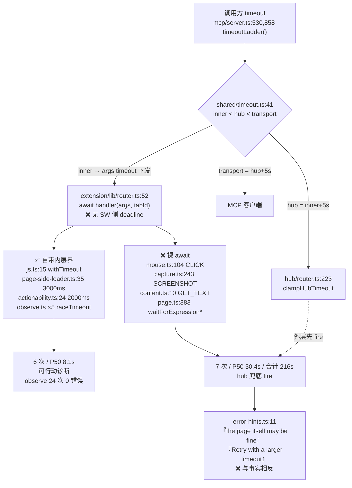

# 内层预算缺席 —— 实现思路

来源：2026-08-18 对 Claude Code transcript 当日窗口（518 次 vortex 调用 / 3 会话 / 24 次错误）的挖掘。
错误率 4.8% 本身健康（30 天基线 20%+），问题在**错误的构成**：7 次 `Request X timed out` 吃掉 216 秒，
占当日全部 vortex 调用总耗时（19.1 分钟）的 **18.9%**。

## 0. 实现流程图



`*` waitForExpression 有 timeout 参数，但计时器 `setTimeout` 跑在**被测页面主线程**（`page.ts:415`），
页面卡死时 poll 不执行 → 内层等同缺席。实证：调用方传 `timeout:15000`，实际在 **20147ms**
（= 15000+5000 的 hub 层）被 transport 打断。

## 0.5 问题重定义

**表象**：若干工具偶发 30 秒超时。
**真正失效的机制**：超时阶梯的**内层只建成了三分之二**。`shared/timeout.ts:6-8` 明写
「extension handler 内层预算 < hub pending < 客户端传输，递增才能让说得清原因的那一层先应答」，
而 `extension/lib/router.ts` 从不施加内层 deadline，是否有界完全取决于各 handler 自觉。
结果每次页面或 CDP 卡住，必然由最外层的 hub 兜底 fire，真实原因（页面主线程被长任务占住 /
CDP 命令排队 / executeScript 不 settle）在跨进程边界处被丢弃，只剩 transport 语义。

**约束分类**

| 约束 | 分类 | 依据 |
|---|---|---|
| 页面主线程被长任务占住时，页面侧计时逻辑不执行 | 物理必然 | Chrome 单线程渲染器；`js.ts:131` 已实证并据此改用 SW 计时器 |
| CDP 命令排在页面事件循环之后 | 物理必然 | `mouse.ts:129-132` 三次 dispatchMouse 全裸 await |
| `chrome.scripting.executeScript` 在坏 SW/tab 态既不 resolve 也不 reject | 物理必然 | `lib/race-timeout.ts:9` 注释已实证（PROBE/INJECT 同族修复） |
| 内层界靠单点补丁积累，不是 handler 默认 | **历史习惯** | `b867555` 探针、`1d47dc9` 注入、`observe.ts` 各修各的；通用工具 `lib/race-timeout.ts` 只有 observe 一个消费者 |
| hint 文案假设「页面可能没问题」 | **历史习惯** | `error-hints.ts:11`；该假设只在 inner 存在时成立 |

**反事实**：若内层界是 router 的默认约束，当日 7 次 hub 兜底会在各自预算内早失败并给出分类原因，
省约 150 秒，且 hint 不再反向指引 → 问题消失。**根因即「内层界非默认」这条历史习惯**，本次修根因。

## 1. 目标与判据

1. `extension/lib/router.ts` 对**每个** action 施加 SW 侧 deadline，新增 handler 默认有界，无需自觉。
2. 超时错误按探活结果分类为「页面主线程无响应」/「CDP 未应答」/「扩展侧超时」，各自 hint 与事实一致。
3. **零回归判据**：任一 action 的默认预算不得低于其在当日日志与 bench 中的成功耗时上限
   （实测参考：observe 17.1s、navigate 25.4s、screenshot 12.6s、mouse_click 12.2s 均为成功调用）。
4. 复跑 `scripts/usage-baseline/collect.mjs`，`Request \S+ timed out` 签名归零；
   P99 调用耗时从 30447ms 下降。

## 2. 现状勘察

- 单一收敛点：`extension/lib/router.ts:52` `await handler(request.args, request.tabId)`，
  全部 action 唯一入口，catch 分支已区分 VtxError 与裸 Error。
- 内层预算已有下发通道：`mcp/src/server.ts:530,858` 把 `ladder.inner` 写回 `args.timeout`，
  handler 侧以 `args.timeout as number` 读取（如 `page.ts:363`）。调用方未指定时**不下发**，
  这正是缺省预算表要填补的空缺。
- 可复用机制：`lib/race-timeout.ts`（哨兵语义，降级场景）与 `handlers/js.ts:15 withTimeout`
  （抛 TIMEOUT，直达调用方）。router 层要的是后者语义。
- 阶梯常量单一真源：`shared/timeout.ts`（`TIMEOUT_LADDER_STEP_MS=5000`、`MAX_INNER_TIMEOUT_MS=60000`），
  hub 默认 `hub/router.ts:31 REQUEST_TIMEOUT_MS=30000`。缺省 inner 必须 ≤ 30000-5000。
- 硬约束：MV3 SW 可被回收，长 deadline 的 setTimeout 不保证存活——预算上限仍受 `MAX_INNER_TIMEOUT_MS` 约束。

## 3. 候选路线

**A. router 层统一内层界（选定）** —— 在 `dispatch` 包一层 SW 侧 deadline，预算取
`args.timeout ?? ACTION_DEFAULT[action] ?? GLOBAL_DEFAULT`，超时前做一次轻量探活再分类抛错。
行得通：单一入口、机制现成、预算下发通道已在。代价：需为每个 action 定默认预算，
长操作（fullPage 截图、scroll extract、navigate networkidle）必须单独放宽。
失效条件：某 action 的真实耗时分布远超默认预算且调用方不传 timeout → 把本来会成功的慢操作砍掉。

**B. hub 兜底改成诊断** —— 不动 handler，hub deadline fire 前向同 tab 发探针，据结果分类。
行得通：改动集中一处、零 handler 回归。代价：**不省那 216 秒**，只改诊断质量；
且探针要跨 NM 往返，页面卡死时探针本身也可能挂住。

**C. MCP 层缩短默认预算** —— 为每个工具在 schema 层给默认 timeout，让阶梯整体下移。
**已被当日数据证伪**：`wait_for` 传了 `timeout:15000` 照样在 20s 被 hub 打断，
因为它的内层计时器跑在页面线程。C 单独不成立。

## 4. 取舍与选定

选 **A**。放弃 B 作为独立方案，因为它不触碰「外层先 fire」这一条本身——诊断变准了，
每次仍要烧满 30 秒，而当日 216 秒等待正是主要代价；B 的探活分类被吸收进 A 的错误分类中，
在 extension 侧做还省一次 NM 往返。放弃 C，因为当日 `wait_for` 样本直接证伪其前提。
放弃「只给出事的 4 个 handler 各补 raceTimeout」，因为那正是造成本缺陷的历史习惯本身
（`lib/race-timeout.ts` 已存在却只有一个消费者就是证据），下一个新 handler 会复现。

## 5. 改动地图

| 位置 | 改动 |
|---|---|
| `shared/src/timeout.ts` | 新增缺省内层预算常量与 per-action 预算表（单一真源，hub/extension 共读） |
| `extension/src/lib/router.ts` | `dispatch` 内对 handler 调用施加 SW 侧 deadline；超时走探活分类 |
| `extension/src/lib/`（新文件） | 超时后的轻量探活：`chrome.tabs.get` + 300ms 有界 `executeScript(()=>1)` |
| `shared/src/errors*.ts` | 新增/复用错误码与 hint：页面主线程无响应、CDP 未应答 |
| `hub/src/error-hints.ts` | 修订 `RPC_TIMEOUT_HINT`——内层就位后，hub 兜底成为真正的异常路径 |
| `extension/src/handlers/page.ts` | 次要项：waitForExpression 计时移出页面线程（SW 侧持有 deadline） |
| `extension/src/action/*` | 次要项：CDP 被占时 `act useRealMouse` 降级为合成事件路径 |

数据流不变，只在 request 进入 handler 前后各加一道 deadline 与分类。

## 6. 被证伪的直觉

- **「hub 又在无视调用方 timeout」**（`558547d` 之前的老形态）：核实 `clampHubTimeout` 与
  `timeoutLadder` 后证伪，阶梯计算正确；`wait_for` 的 20147ms 恰是 15000+5000 的 hub 层，
  说明 inner 被跳过而非被覆盖。
- **「vortex 与 playwright 抢 debugger」**：当日 playwright 仅 1 次调用，2 次 `CDP_NOT_ATTACHED`
  集中在同一 tab（相隔 3 小时），是常驻 DevTools，与既往结论一致。
- **「observe 用得少是能力缺陷」**：当日 observe 24 次 0 错误，慢调用（11.4s / 17.1s）全部成功降级，
  正是内层界生效的对照组。

## 7. 待验证假设

（Task 9 live 于 2026-08-19 在 Chrome 151 复核，构建戳 `2.0.1+mszn6kc9`）

| 假设 | 状态 | 依据 |
|---|---|---|
| `mouse.click` 30s 挂住是 CDP 命令排队而非 `debugger.attach` 卡住 | **已证实** | 主线程 90s 长任务页面上 `mouse_click` 30s 超时，同一时刻探活判定 page-unresponsive；DevTools 对照组里 attach 每次都秒成，卡的是等渲染进程应答的 dispatch |
| 页面主线程卡死时 300ms 探针 `executeScript` 确实超时 | **已证实** | 同一次 live：page-unresponsive 这一态只可能来自探针超时，hint 确为长任务那条 |
| `navigate` 那次 42413ms 超过 hub 30s 默认 | **仍未查明** | 本轮未查 `hub/router.ts` 的 `InternalRequestTimeoutError` 重试是否延长 deadline；hub 缺省兜底已改由 action 预算推导，但这不解释旧值如何被突破 |
| 默认预算不会砍掉慢但成功的调用 | **部分证实** | juejin.cn 抽查 navigate/observe/extract/screenshot/act 均未被砍；样本小，真正验收看一周窗口 |
| 打开 DevTools 会占住 `chrome.debugger`（计划里当作降级路径的复现手段） | **已证伪** | Chrome 151 上 DevTools 先于扩展 attach（docked 853px 实测），`chrome.debugger.attach` 仍成功、`act useRealMouse` 照走 `mode:"realMouse"`。真实占用方是另一个 attach 在先的扩展；相关 hint 文案已按此改写 |

## 8. 数据校准与两处订正（勘察后补）

用 30 天 transcript 重算**未传 timeout 的成功调用**耗时分布（传了 timeout 的样本会污染缺省值校准）：

| action 对应工具（变体） | n | P50 | P95 | P99 | max |
|---|---:|---:|---:|---:|---:|
| navigate `waitUntil=networkidle` | 233 | 3164 | 25377 | 27028 | **69861** |
| observe | 195 | 1639 | 13774 | 25599 | 27999 |
| act | 441 | 854 | 11962 | 25480 | 26114 |
| navigate（其他 waitUntil） | 118 | 1687 | 10493 | 14118 | 25927 |
| mouse_click | 180 | 834 | 10805 | 19731 | 22145 |
| screenshot | 399 | 796 | 4896 | 11286 | 20870 |
| extract `scroll=true` | 21 | 2026 | 10077 | 10689 | 10689 |
| extract | 118 | 288 | 804 | 2989 | 3312 |
| wait_for | 35 | 1262 | 5850 | 10046 | 10046 |
| evaluate | 1787 | 376 | 1808 | 4336 | 7914 |

**订正一：缺省内层预算不能从 hub 的 30s 倒推。** 第 1 节判据 3 原本暗示
「GLOBAL_DEFAULT 取 hub 默认 - step = 25s」，但 act P99 25480 / observe P99 25599 /
navigate 25927 的**成功**调用就贴在这条线上，25s 的内层界会砍掉真实成功的尾部。
正确做法是**正向推导**：每个 action 声明自己的预算 `ACTION_BUDGET[action]`，
MCP 侧按 `max(ACTION_BUDGET[action], 调用方 timeout) + STEP` 算 hub deadline，
让 hub 随 inner 上移，而不是让 inner 被 hub 反向挤压。如此所有当前能成功的调用一律不受影响，
inner 只捕获真正的永挂。

**订正二：`args.timeout` 在各 handler 语义不同，router 层不得复用它当总预算。**
`handlers/page.ts:363` 用它作整体等待预算；`handlers/dom.ts:255` 用它作 actionability gate
的自旋预算（默认仅 2000ms）；`handlers/js.ts` 用它作脚本执行预算。若 router 直接拿
`args.timeout` 当 handler 总 deadline，`act` 传 `timeout:5000` 会连带把 scrollIntoView 与
CDP 三连击一起砍在 5 秒——而 act 的成功 P99 是 25.5 秒，必然回归。
router 的 inner deadline 只认 `ACTION_BUDGET` 表与显式下发的专用字段，与 `args.timeout` 解耦。

**同源推论**：现状下 `act timeout:5000` 会让 hub 变成 10s（`timeoutLadder` 直接用调用方值），
这本身就可能是历史上 act 超时的一部分来源——订正一的 `max()` 一并修掉它。

**订正三（写计划时自检发现）：内层预算必须随调用方 timeout 上移，不能只取表内缺省值。**
`js.evaluate` 自己用 `args.timeout` 作脚本预算，30 天内传了 timeout 的成功调用 max 42545ms。
若 router 只按表给 30s 缺省，`evaluate(timeout:45000)` 会被内层砍掉——**新机制自己制造回归**。
最终公式（单一真源在 `shared/src/timeout.ts`）：

```
inner = max(ACTION_BUDGET[action], caller > 0 ? caller + STEP : 0)
hub   = inner + STEP
transport = hub + STEP
```

如此对任意 action 与任意调用方取值，`inner < hub < transport` 恒成立，且没有任何当前能成功的
调用会被新界砍掉。实施计划见 `docs/superpowers/plans/2026-08-18-inner-timeout-budget.md`。

**订正四（Task 1 评审裁决）：调用方入参要钳，推导结果不钳。**
订正三的公式让 `caller` 无上限地抬高内层界。而 `schemas-public.ts` 三处 `timeout` 字段只有一处
（`:375`）设了 `maximum`，另两处（`:70`/`:261`）不设上限——调用方传 `timeout: 3600000`，内层界就是
一小时，router 等于没有界，本次要消灭的 bug 原样复活。

评审建议对结果取 `min(inner, MAX_INNER_TIMEOUT_MS)`，**已否决**：调用方合法要 60s 时把内层界钳成
60s 即零 margin，内层与 handler 自身预算同时到点，正好砍掉订正三要保住的那类长调用。

`MAX_INNER_TIMEOUT_MS` 的既有语义是「**调用方可指定的**上限」（`timeout.ts:19`），约束入参。故：

```
inner = max(ACTION_BUDGET[action], caller > 0 ? min(caller, MAX_INNER) + STEP : 0)
```

推论：`inner ≤ MAX_INNER + STEP = 65000`，`hub ≤ 70000`，`transport ≤ 75000`，全部有界。

### 8.1 `page.navigate` 取 60s 而非 69861ms（Task 10 评审补记）

零回归判据的字面读法要求预算 ≥ 该 action 的成功耗时 max，`navigate waitUntil=networkidle`
那条 max 是 69861ms，表里却取 60_000。这不是漏掉：handler 自身的等待上限是
`NAVIGATE_LOAD_TIMEOUT_MS = 25_000`（`extension/src/handlers/page.ts`），handler 本体
不可能跑出 69861ms，那条样本来自 hub 侧缓冲/重试而非 handler。抬到 70_000 只会让 router
的界比 hub 兜底还晚，反而破坏阶梯。故判据在此 action 上按「handler 可达上限」解读。

