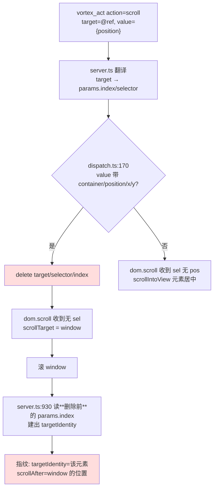

# 让 scroll 真正尊重 @ref —— 实现思路

> 缘起：Task 6 实测发现 scroll 效果指纹在唯一会产出指纹的调用形式下**误归属**——把 window 的滚动位置挂在具名元素的身份上。定位后发现根因不在指纹层，在 `vortex_act` 的 scroll 参数分流。

## 0. 实现流程图

红色两处即缺陷所在：删除发生在 dispatch，而指纹读的是删除前的 params。

## 1. 目标与判据

1. `vortex_act action=scroll` 传 `target=@ref` + `position` 时，**滚动的元素与指纹里 `targetIdentity` 指向的元素一致**。
2. Task 6 的 scroll 断言能真跑通：`fingerprint.scrollAfter.top` 是该容器的实际滚动位置（fixture 里应为 1120 量级，不是 0）。
3. 现有两处 scroll 调用方（均不传 target）行为**字节级不变**。
4. 不引入新的静默失败：目标元素不可滚时必须 `moved:false`，不得伪装成功。

## 2. 现状勘察

**调用链**（已实测逐段确认，非推断）：

- `packages/mcp/src/server.ts:785-787` —— 指纹守卫，`fpActive` 判 `params.action ∈ FP_ACTIONS`。
- `packages/mcp/src/tools/dispatch.ts:158-175` —— scroll 参数分流。**根因在此**：`value` 带 `container`/`position`/`x`/`y` 时 `delete next.target / next.selector / next.index`，注释写明是为了不让 handler 见 selector 就走 scrollIntoView。
- `packages/mcp/src/server.ts:930-933` —— 指纹块读 `params.index`（**dispatch 删除的是 `next`，不是 `params`**，所以这里仍拿得到），经 `lookupIdentity` 建 `targetIdentity`。
- `packages/extension/src/handlers/dom.ts:1363-1503` —— `dom.scroll`。三条分支：`cont` → 滚该容器；`sel && pos && !cont` → 滚 `findScrollableAncestor(el)`；`sel` 单独 → `scrollIntoView`。

**实测三种调用形式**（fixture `_spike-scroll-ref.html`，扩展 `2.0.1+msrcf5o4` 已确认为最新构建）：

| 形式 | 实际滚谁 | 指纹 |
|---|---|---|
| `target=@ref` + `value={position:"bottom"}` | window | 有指纹，**误归属** |
| `target=@ref`，无 value | scrollIntoView 该元素 | 无指纹（结果无 `scrollTop` → `extractSignals` 返回 undefined） |
| `value={container:"#v2",position}` | 该容器（实测 scrollTop=1120） | `fingerprintSkipped`（无 index，诚实） |

**硬约束**：

- `dom.ts:1423` 的 `sel && pos && !cont` 分支经 `vortex_act` **永远进不去**——dispatch 必然先剥 selector。该分支带着 2026-05-21 P1-5 的根因注释，描述的是公开面够不到的行为。
- 指纹的 `targetIdentity` 依赖 `params.index`（来自 @ref）；CSS selector 路径无 index，`applyFingerprint` 返回 `fingerprintSkipped`，这一诚实语义要保住。
- observe 只对有真实角色的容器发 @ref（实测：`
` 不发，`<section>`/`<ul>`/`role=listbox` 发）。所以本改动的受益面 = 有角色的滚动容器。

**可复用**：`dom.scroll` 的 `cont` 分支已实测可靠（1120 ✓），不需要新写滚动逻辑。

## 3. 候选路线

### 路线 A：dispatch 把 target 翻成 `container` 下发

`value` 带 position 且存在 target 时，不再无条件删 selector，而是把已翻译出的 selector 填进 `container` 字段，再删 `target`/`selector`/`index`。

- 切入点：`dispatch.ts:170-175` 一处。
- 为什么行得通：复用实测可靠的 `cont` 分支；`selector` 仍被删除，不会误触 `scrollIntoView`；`params.index` 不受影响，指纹身份天然正确。
- 代价：语义变成「**把这个元素当滚动容器本身**」。若 @ref 指向的是列表*项*而非容器，`scrollTo` 对它无效 → `moved:false`。
- 失效条件：调用方本意是「把这个项滚进视野」时会拿到 `moved:false` 而非预期滚动。

### 路线 B：少删一个字段，接通既有的 `sel && pos` 分支

只删 `target`，保留 `selector`，让 `dom.ts:1423` 那条分支第一次真正生效。

- 切入点：同样是 `dispatch.ts:170-175`，改动更小。
- 为什么行得通：该分支走 `findScrollableAncestor(el)`，**从元素自身开始**上溯（`dom.ts:1394` 实测确认），元素自己可滚时返回自己，否则返回最近可滚祖先。
- 代价：语义是「**滚这个元素所在的滚动容器**」，比 A 宽容；但 `findScrollableAncestor` 返回祖先时，指纹的 `targetIdentity` 指的是元素、`scrollAfter` 是祖先的位置——**误归属会以更隐蔽的形式回来**。
- 失效条件：@ref 指向不可滚元素时，指纹再次错位。

### 路线 C：新增显式参数，默认行为不变

加 `value.scrollSelf: true`（或 `target` 语义开关），只有显式声明时才把 target 当容器。

- 切入点：`dispatch.ts` + `schemas-public.ts` 描述 + I15 预算。
- 为什么行得通：零回归风险，老调用方完全不受影响。
- 代价：多一个参数要让模型学会用；工具面字节数增加；且「默认仍是错的」——不显式传就还是误归属，与「诚实表征」的定位相悖。
- 失效条件：模型不知道要传这个参数时，缺陷照旧。

## 4. 取舍与选定（**未选定，待关卡**）

倾向 **路线 A**，理由是它让「身份」与「被滚对象」严格一一对应：dispatch 把 target 翻成 container，滚的就是那个元素本身，指纹的 `targetIdentity` 与 `scrollAfter` 天然同源，不存在错位的可能。

放弃 **路线 B**，因为 `findScrollableAncestor` 会上溯到祖先——那一刻 `targetIdentity`（元素）与 `scrollAfter`（祖先）又不是同一个东西，**误归属换了个形式回来**，而这正是本次要根除的缺陷类别。它更小的改动量买不回这个代价。

放弃 **路线 C**，因为默认路径仍然产出错误指纹。本项目的定位是诚实表征层，把「正确」放在一个模型多半不会传的开关后面，等于承认默认输出不可信。

## 5. 改动地图（以路线 A 为例）

- `packages/mcp/src/tools/dispatch.ts` —— scroll 分流处：target 存在时填 `container`，随后照旧 strip。唯一的行为改动点。
- `packages/mcp/src/tools/schemas-public.ts` —— `vortex_act` 描述补一句 target 在 scroll 下的含义（当前只写了 `scroll:value={container?,position}`）。触及 I15 字节预算，按惯例登记。
- `packages/mcp/tests/` —— dispatch 映射的纯函数单测：给定 target+position，断言下发参数里 `container` 等于翻译出的 selector 且 `selector`/`index` 已被删。
- `packages/vortex-bench/cases/fingerprint-actions.case.ts` —— Task 6 的 scroll 断言由「有 scrollAfter」加强为「scrollAfter.top 与容器实际位置一致」。
- **不碰** `packages/extension/src/handlers/dom.ts`：`cont` 分支已实测可靠，无需改动。

## 6. 被证伪的直觉

- **「observe 收不到 region，所以容器拿不到 @ref」——错。** 我据 `observe.ts:192` 的 B009 注释推断 region/tabpanel/listbox 常不在 `collectedEls` 里，实机四变体对照直接推翻：`<section aria-label>` 发 `@0c13:e0`。
- **「`moved:false` 是陈旧扩展 dist 的假象」——错。** 主仓 dist 确实是 8月7-11 的旧构建（这条是真的，也解释了 codex 遇到的 fill 缺 `value`），但重建到 `msrcf5o4` 并经 `vortex_dev_reload` 确认加载后，行为完全一致。
- **「`dom.ts:1423` 那条分支是活的」——错。** 它经 `vortex_act` 永远进不去，注释描述的是够不到的行为。

## 7. 待验证假设

| 假设 | 状态 | 实施前必须做什么 |
|---|---|---|
| 无调用方依赖「target+position 滚 window」的现行为 | **已查** | bench 仅两处 scroll，均不传 target；工具描述也未文档化该组合 |
| `cont` 分支对 @ref 翻译出的 selector 同样可靠 | **推测** | 翻译出的 selector 未必是 `#v2` 这种简单形式，需实测一次带 @ref 的完整链路 |
| 改后 `f-scroll-to-bottom` 与 jd-review 两 case 不回归 | **推测** | 跑全量 bench 对照 |
| I15 字节预算能容纳描述补充 | **推测** | 改完实测，超了按惯例调 cap 并登记理由 |
