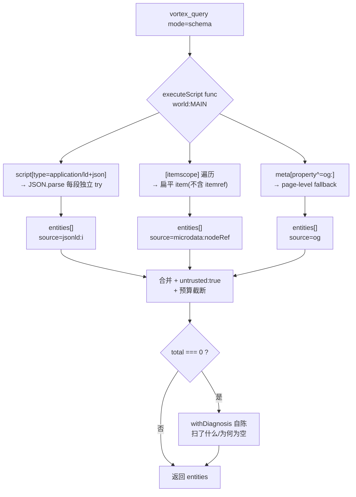

# 结构化回读 + 外部基线对照 —— 实现思路

来源：`Knowledge-Library/12-Projects/N0001/2026-08-13-vortex升级决策外部技术调研-V1-设计.md`（O7 + O12），
路线关卡已选定「A 结构化回读 + 外部基线」，WebMCP/APC 只做只读探测 spike。

## 0. 实现流程图

## 1. 目标与判据

**O7**：在有页面作者声明结构化数据的站点上，一次 `vortex_query mode=schema` 拿到带来源的实体，
不再靠 `evaluate` 旁路或文本正则去猜页面事实。

可验证判据：
1. 5 个真站（商品页 / 新闻文章 / 菜谱 / 招聘 / 组织首页）各返回 ≥1 实体且 `@type` 与页面内容一致
2. 无结构化数据的页面返回空 **且自陈原因**（复用 `41a461f` 的 `withDiagnosis`），不是静默空
3. 单段非法 JSON-LD 只让那一段报错，其余段照常返回
4. 每个实体带 `source`（`jsonld:<i>` / `microdata:<nodeRef>` / `og`）和 `untrusted: true`
5. 默认输出不超过现有 query 模式量级，超限带 `truncated` 标记

**O12**：同一组 fixture 上拿到 vortex 与 `chrome-devtools-mcp` 的可比数字（输出字节、目标可定位率、
端到端延迟），破掉「只用自家 bench 自证」的闭环。

判据：产出一份带**环境不对等声明**的对照报告；不以任何单项数字宣称 parity。

**不包含**：不建 RDF store、不建永久事实库、不做 `itemref`、不做 edges 图、不碰 observe 的输出形状。

## 2. 现状勘察

query 的 mode 扩展点已被 `sheet`/`flow`/`chart` 走通三次，形状固定：

- `packages/extension/src/handlers/query.ts:1290` `registerQueryHandlers` 注册 `QueryActions.QUERY_PAGE`
- mode 白名单校验：`query.ts:1297-1306`（新增 mode 必须同时改这里和错误文案）
- 每 mode 一个自包含 page-side func + `executeScript({func, args, world:"MAIN"})`：
  flow `:1406-1424`、chart `:1425-1445`、sheet `:1446-1466`、style `:1467-1490`
- `pattern` 在 chart/sheet 是**预留参数**（`:1427`、`:1448`）——schema mode 同样可先收下作 `@type` 过滤
- 公开 schema 的 mode enum：`packages/mcp/src/tools/schemas-public.ts:454`
- bench 的 MCP 客户端已经是通用的：`packages/vortex-bench/src/runner/mcp-client.ts:19`
  `createMcpConnection({command, args})`，指向别的 MCP server 无需改造

硬约束：

- **page-side func 注入会丢模块作用域**，func 必须完全自包含；单测须用 `new Function` 剥离作用域复刻注入，
  否则是假绿（见 memory `vortex_page_side_func_inline_gotcha`、`vortex_test_pageside_pure_fn`）
- WHATWG 明确 microdata item 与页面视觉内容**无自动语义关系**（S33）→ 必须保 nodeRef，不能只信属性
- Google 官方口径：结构化数据是页面作者的**声明**，不保证与可见内容一致（S36/S37）→ `untrusted` 不可省
- JSON-LD 通常在 `<head>`，不在 shadow 内；Microdata 可能在 shadow 内，v1 只扫 light DOM 并显式声明

可复用：`withDiagnosis(v, null)` 返回 v 本身，空结果自陈是零成本的；`normalizeCssAttrParam`
（`query.ts:1283`）是参数归一化的既有范式。

## 3. 候选路线

**路线 1 —— 纯 page-side DOM 解析**：一个自包含 func 里扫 `script[type="application/ld+json"]`、
`[itemscope]`、`meta[property^="og:"]`。切入点在 `query.ts` 的 mode 分支，改动落在扩展 handler 层。
行得通是因为三种来源全是普通 DOM 查询，且 JSON-LD 集中在 `<head>`。代价：Microdata 的 `itemref`
跨节点引用要自己实现。失效条件：数据由 JS 在 MAIN world 外动态注入（罕见）。

**路线 2 —— CDP `DOMSnapshot.captureSnapshot` 后在扩展侧解析**：优点是一次拿全量、含 layout，
可以顺带判可见性。代价：`DOMSnapshot` 是 Experimental，且为了几个 `itemprop` 要付整页 DOM+styles 的
payload。失效条件：大页面上 payload 和延迟失控。

**路线 3 —— 只做 JSON-LD + OGP，Microdata 留待有证据**：改动最小、边界最干净。
代价：老站（尤其国内电商）Microdata 仍有存量，覆盖率会低一截。失效条件：实测发现目标站点大量用 Microdata。

## 4. 取舍与选定

**选路线 1，但按路线 3 的边界裁剪 Microdata**：v1 支持 `itemscope/itemtype/itemprop` 扁平与嵌套 item，
**不支持 `itemref`**，且在返回里显式标出「本页存在 itemref，已跳过 N 个属性」。

放弃路线 2，因为 `DOMSnapshot` 在 Experimental 状态下为了拿 `<head>` 里几段 JSON 要付整页
DOM/layout/styles 的传输成本，而报告 §13 自己把「全量 snapshot 成本过高」列为风险；同一份数据用
`querySelectorAll` 是 O(1) 级，没有任何理由走全量快照。

放弃纯路线 3（完全不做 Microdata），因为跳过它省下的只是一段遍历代码，而缺了它在老站上会直接返回空——
那正是判据 2 里「空且自陈」最难解释的一类假空。`itemref` 单独砍掉：它是跨节点引用，实现复杂度陡增，
而实际使用率远低于基础三属性，先返回「已知跳过」比返回错误的实体更诚实。

## 5. 改动地图

| 层 | 文件 | 改动 |
|---|---|---|
| 扩展 page-side | `packages/extension/src/handlers/query.ts` | 新增自包含 `schemaProbeFunc`；抽出可单测的纯函数（JSON-LD 解析、Microdata item 归一、OGP 收集、预算截断） |
| 扩展 handler | 同上 `:1297-1306`、mode 分支 | mode 白名单加 `schema`；新增分支调用 probe + `withDiagnosis` |
| MCP 公开面 | `packages/mcp/src/tools/schemas-public.ts:454` | mode enum 加 `schema`，description 说清「页面作者声明、可能与可见内容不一致」 |
| bench | `packages/vortex-bench/cases/` | 新增结构化数据 fixture case（有/无/非法 JSON-LD/含 itemref） |
| bench 对照 | `packages/vortex-bench/src/runner/` | 新增 external-baseline runner，复用 `mcp-client.ts` 指向 chrome-devtools-mcp |
| 探测记录 | `reports/` | WebMCP / APC 只读探测结果 |

数据流：page-side 三源并行采集 → 扁平 `entities[]`（不建边，`@id` 引用留在 props 里）→
合并去重 → 预算截断 → 空则自陈 → 回 MCP。

## 6. 被证伪的直觉

- **以为报告的 O1「把 AX 从元素覆盖层升级为页面语义接口」是本轮最大价值**。读代码发现 observe 早已是
  嵌套 a11y 树（`1c02b04`）叠 AX 语义覆盖层（`b96cc1a`）；报告的 Vortex 基线只引用了 4 个文件（I01），
  把已完成的工作当成了新建议。剩余缺口只是 provenance 字段，价值远低于报告给的 P0。
- **以为 O8 增量观察可以复用现成事件设施**。`packages/mcp/src/lib/event-store.ts` 是 MCP 侧的
  `VtxEvent` buffer，与 CDP 的 `DOM.documentUpdated` / `Accessibility.nodesUpdated` 无关；
  扩展侧要新铺一整层订阅，成本远高于预估，且 observe 只占真实调用量的 4%，收益未证。
- **以为报告建议的 nodes/edges graph 是必需输出形状**。报告 §8.3 自己写了「内部不必一开始引入完整
  RDF store」，扁平 entities 已能满足全部判据。

## 7. 待验证假设

实查的：query mode 扩展点形状、`pattern` 为预留参数、bench MCP client 可参数化、
`1a9048c` 在 main 上、无任何 JSON-LD/Microdata/WebMCP/APC 相关代码。

**已实测（2026-08-13，Edge 真实浏览器）**：

| 站点 | JSON-LD | Microdata | OGP |
|---|---|---|---|
| bilibili 视频页 | **3 段**：WebPage / VideoObject / BreadcrumbList，含 `@id`、`mainEntity`、`breadcrumb` | 0 | 16（`property=`）|
| github 仓库页 | 0 | **2 item**：`schema.org/SoftwareSourceCode`，5 个 itemprop | 9（`property=`）|
| MDN 文档页 | 0 | 0 | 11，但用 **`name="og:url"`** 而非规范的 `property=` |
| 京东首页 | 0 | 0 | 0 |

三条结论直接落进设计：

1. **三种来源都必须做**——单做 JSON-LD 会漏掉 GitHub 这类纯 Microdata 站，§4 保留 Microdata 的取舍成立
2. **OGP 探测必须同时收 `property` 和 `name` 两个属性**。MDN 的写法不符合 OGP 规范但真实存在，
   只按规范写选择器会静默返回空——这正是判据 2 要防的那类假空
3. `itemref` 四个站点全为 0，v1 砍掉它的代价确认很低

**仍是推的，实施前必须实测**：

1. `chrome-devtools-mcp` 能否在本机跑起来（npm 有 1.7.0，本机 Chrome 151 已过 144 的 auto-connect 门槛，
   但未验证连接方式）——决定 O12 的环境不对等有多大
2. 当前 Chrome 151 是否真的存在 `WebMCP` domain 与 `Page.getAnnotatedPageContent`——spike 的前提
3. 空结果自陈的归因维度（扫了几个 script / 几个 itemscope / 有没有非法 JSON）必须在 page-side 就采集，
   事后补不回来——与 `41a461f` 踩过的坑同构

**已知范围限制**：内部后台 SPA（班牛、ad.bytenew.com 这类）不会有页面作者声明的结构化数据，
`mode=schema` 在这类站上恒为空。本能力的价值集中在公开内容站，不能拿它当通用页面事实回读手段宣传。
