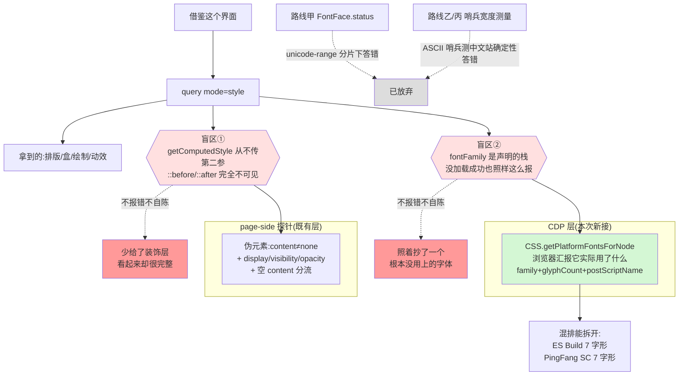

# 伪元素与字体真相：实现思路

> 触发：「我有时候会找一个网站想让模型通过 vortex 分析，从而在界面上进行借鉴」——
> 这个用例下 `mode=style` 有两处**静默盲区**：伪元素装饰完全看不见、字体只报声明的栈。
> 状态：**已选定路线丁**（CDP `CSS.getPlatformFontsForNode`）。丙一度被选定，经与 Luna
> 对抗辩论 + live spike 推翻——见 §4、§8。

## 0. 实现流程图

## 0.5 问题重定义

**表象**：借鉴界面时「拿到的样式看起来是全的」。

**真正失效的机制**：两处盲区都**不自陈**——不报错、不降级、不说「我没看这部分」，只是悄悄少给或给了个未经验证的声明值。这与本轮刚修掉的 `wcagAA:false`（拿不到背景却说不合格）是同一类病：**把「没看」和「看过了」渲染成同一种输出**。

| # | 机制 | 实证 | 约束性质 |
|---|------|------|---------|
| ① | `getComputedStyle` 全仓从不传第二参 → 伪元素不可见 | `query.ts:909` 的 `pick` 只 `cs.getPropertyValue(...)`；`grep '::before'` 在 src 里只命中 observe 的**类名启发式**注释（`observe.ts:1500/1549/1905` 用 `fa-`/`icon-` 前缀猜图标），那是猜不是读 | 历史习惯 |
| ② | `fontFamily` 直出 computed 的声明栈 | gamma.app h1 报 `ESBuild, sans-serif`；工具不区分「ESBuild 真的用上了」与「ESBuild 没加载、实际是 sans-serif」 | 历史习惯 |
| ③ | `@font-face` 的 src 拿不到 | 借鉴界面要回答「他们用什么字体、哪来的」，现在只能答前半句 | 半物理：只能从 CSSOM `CSSFontFaceRule` 读，跨域样式表读不到 |

**~~物理必然的约束~~ —— 这一条写错了，订正如下**：

> ~~「这个元素实际用哪个 family 渲染的」浏览器**不直接暴露**。只能靠测量推断，或靠 FontFace 状态旁证。这是 CSS OM 的既有边界，不是实现偷懒。~~

**错。** 边界是 **CSS OM 的**，不是**浏览器的**——CDP 的 `CSS.getPlatformFontsForNode`
直接给（§2 实测）。我把「page-side 探针只用 page API」这条**历史习惯**误当成了物理必然，
于是三条候选路线全部落在同一层（都在 page-side 想办法）——正是 CLAUDE.md
自检里「候选路线全部落在同一层 → 说明没拆到根因」那一条。真正的物理必然只剩：

- 跨域样式表的 `@font-face` 规则读不到（CORS）。这条仍然成立，且与「实际渲染字体」无关——
  是两个独立的 evidence。
- debugger 只能有一个使用者：CDP 被别的扩展占住时拿不到，这是平台约束不是实现问题。

**反事实**：去掉①②（都是历史习惯），「借鉴这个界面」就不会再拿到一份缺装饰层、且字体可能是假的样式单。③ 是增量信息，不是当前失效。而去掉「探针只用 page API」这条被误标成物理必然的历史习惯后，②不只是消失——它变成了一个**信息量更高**的字段（哪几个字体各渲染多少字形）。

**本次修根因**：①是纯粹的漏读；②是把声明当结果，两者都是根因本身。

## 1. 目标与判据

1. 元素上**真的在渲染**的伪元素必须出现在返回里；不渲染的不占字节。判据：gamma.app 上 1194 个元素中的 25 个渲染中伪元素能被查到，且 `.css-m7knwo`（`content: none`）不产生 pseudo 字段。
2. 字体必须区分「声明」与「实际」。判据：gamma.app 的 h1 报出首选 `ESBuild` 且标明它确实生效；对一个不存在的字体栈，工具明确说没生效，**不得**沉默。
3. 拿得到 `@font-face` 的来源。判据：gamma.app 报出 `ESBuild → /fonts/ESBuild/ESBuild-Regular.woff2`。
4. 不新增静默盲区：读不到的情形（跨域样式表、测量失败）必须自陈，不能返回空当作「没有」。

## 2. 现状勘察

- `styleProbeFunc` — `packages/extension/src/handlers/query.ts:759`，分组在 `:908-909`（`want` / `pick`），handler 分发与 `attr` 校验在 `:1946-1951`（`ALL_GROUPS`）。
- 伪元素：src 内 `::before` 仅出现在 `observe.ts:1500/1502/1549/1905` 的注释里，是**按类名前缀猜图标**的启发式，与读取无关。
- 字体：`document.fonts` / `FontFace` / `fonts.check` 在 src 内**零命中**。
- `@font-face`：`cssRules` / `styleSheets` 在 src 内**零命中**（与路线 B 同一块未开垦的地）。
- 字节预算：`tools/list` 实测 **11280 B**，cap 11400，余量仅 **120 B**。`attr` 已有 description（在 I15 白名单里），加组名要算进去。

**live spike 第二轮（gamma.app，路线丁，2026-08-19 实测，代码已撤）**：

| 场景 | 声明栈（工具现在报的） | CDP 实际渲染 |
|------|----------------------|-------------|
| h1 原样 | `ESBuild, sans-serif` | `ES Build` / `ESBuild-Bold` / 56 字形 / `isCustomFont:true` |
| h1 改 `NoSuchFontXYZ, monospace` | `NoSuchFontXYZ, monospace` | **`Menlo`** / `Menlo-Bold` / 54 字形 / `isCustomFont:false` |
| h1 文本改 `Hello 中文混排 テスト` | `ESBuild, sans-serif` | **两个**：`ES Build` 7 字形 + `PingFang SC` 7 字形 |

第三行是决定性的：中英混排下 webfont 只覆盖拉丁，中文全走系统 `PingFang SC`——
甲会说「ESBuild 已 loaded」，乙会说「生效了」，**只有丁说得出中文那半其实不是它**。
连字体名都对不上（声明 `ESBuild` / 平台 `ES Build`），推断类方案拿不到这个。

元素集合对齐（承重点，已验）：`Runtime.evaluate`（不 returnByValue）→ `Runtime.getProperties`
拿逐元素 objectId → `DOM.requestNode` → `CSS.getPlatformFontsForNode`，5 元素批量跑通。
**`DOM.getDocument` 必须先调**，否则 requestNode 拿到的 nodeId 在 CSS 域报
`Could not find node with given id`（实测踩到）。
耗时：首次 `DOM/CSS/Runtime.enable` 合计约 450ms（一次性），此后每元素
`requestNode` 2-38ms + `platformFonts` 1-7ms。

**伪元素判据 spike（同页，7 个构造用例，已实测并清理）**：
`content !== "none"` 是必要筛但**不充分**——`display:none`、`visibility:hidden`、`opacity:0`
的伪元素 content 照样是 `"B"/"C"/"D"`，会被误收；`content:""` 要分两种，
带 `background-image`+尺寸的是有效图标块（该收），纯空的不该收。无伪元素的普通元素
稳定返回 `content:"none"`，作为筛子有效。

**live spike 第一轮（gamma.app，已实测）**：
- 伪元素：`getComputedStyle(el, '::before')` 可读；`content` 为 `none` 即不渲染。全页 1194 元素扫出 **25** 个渲染中伪元素（约 2%），稀疏，按需返回不撑体积。
- `document.fonts` 有 **95** 个 FontFace，同一 family 多个 face 分别带状态：`ESBuild: loaded/400, unloaded/400, loaded/500…`。**必须按 weight 匹配**，只看 family 会误判。
- `@font-face` 经 CSSOM 可读 **16** 条，含真实 URL（`/fonts/ESBuild/ESBuild-Regular.woff2`）。
- 测量法有判别力：哨兵 `monospace` 宽 500.91；`NoSuchFontXYZ, monospace` = **500.91**（完全相同 → 确实回落）；`ESBuild, monospace` = 462.85、`PPMori, monospace` = 508.48（≠ 哨兵 → 真的生效）。

## 3. 候选路线

伪元素部分两条路线都一样（`content !== none` 才收，作为 `pseudo` 分组返回），**分歧只在字体**：

### 路线甲 —— 只读旁证（FontFace 状态 + @font-face src）
- 切入点：探针内遍历 `document.fonts`，按 `family + weight` 匹配元素首选字体，报 `fontLoaded: true|false|"unknown"`；另从 CSSOM 收 `@font-face` 的 family→src。
- 为什么行得通：已 spike，状态与 src 都拿得到，且**完全只读**，不碰页面 DOM。
- 代价：只能说「该 family 有 loaded 的 face」，**不能断言这个元素就是用它渲染的**——unicode-range 不覆盖、weight 差异、字形缺失时浏览器仍会 fallback，状态却是 loaded。属于强旁证，不是证据。
- 失效条件：字体经 `unicode-range` 分片（中文站常见）时，loaded 的那片可能根本不含本元素的字符。

### 路线乙 —— 测量法（哨兵宽度对比）
- 切入点：探针内建一个 offscreen ``，用「声明栈 + monospace 哨兵」渲染固定字串，与「纯 monospace」比宽度；不等即首选字体真的生效。
- 为什么行得通：已 spike 且**带反向对照**——不存在的字体宽度与哨兵完全相同（500.91），真字体明显偏离。直接回答判据 2 要的那个问题。
- 代价：**要往页面里插节点再移除**。探针至此一直是纯读，这会打破该性质；在 CSP 严格站、`document.body` 尚未就绪、或页面有 MutationObserver 监听全局的站点上可能有副作用或被观察到。
- 失效条件：等宽度巧合（概率极低，可用多字串降低）；body 不可写时失败——必须自陈而非静默。

### 路线丁 —— CDP 直接问浏览器「你实际用了哪个字体」（**选定**）
- 切入点：`CSS.getPlatformFontsForNode`。仓库已有 `debuggerMgr.sendCommand`
  （`packages/extension/src/lib/debugger-manager.ts:172`），只需把 `CSS` 加入
  `DOMAINS_WITH_ENABLE`（`cdp-domains.ts:14`）并给 `registerQueryHandlers` 接上
  `DebuggerManager`（目前签名不带，`query.ts:1676`）。
- 为什么行得通：**不是推断，是浏览器汇报渲染结果**。gamma.app live spike 全链跑通，
  实测见 §2。
- 代价：要 attach debugger（调试横幅、可能被别的扩展占住）；首次三域 enable 约 450ms。
- 失效条件：debugger 被占（`CDP_BUSY`）→ 必须自陈拿不到，**不能**回落到会答错的测量法。

### 路线丙 —— 甲 + 乙，测量为主、状态为辅、失败即自陈
- 切入点：默认走测量；插节点失败时回落到 FontFace 状态并在返回里标明「这是旁证不是实测」。
- 代价：两套逻辑 + 一个降级判据，代码量约为单条路线的 1.8 倍；两者结论不一致时要定义谁说了算。
- 为什么可能仍值得：这个用例的失败代价是「照着抄了一个根本没用上的字体」，旁证不够。

## 4. 取舍与选定

**选定路线丁。** 甲/乙/丙全部放弃——它们在回答同一个问题：「首选字体生效了吗」；
而丁回答的是浏览器实际做了什么，且带 `glyphCount`，能说清一个元素里**哪几个字体各渲染了多少字形**。

放弃**丙（原选定）**，因为 unicode-range 分片下它会**确定性答错**：
`font-family: Brand, monospace` + `@font-face{unicode-range: U+4E00-9FFF}`，元素文本是中文、
Brand 确实在渲染，但 ASCII 哨兵按 monospace 回落 → 宽度相同 → 丙报「未生效」。中文站这不是边角情形。
要把丙修对，需要同时成立：用元素真实文本、按脚本分样本、复制
`font-size/weight/stretch/style/variation/letter-spacing/font-size-adjust`、
`white-space:pre` 防换行、宽度有限性校验、区分「测量失败」与「未生效」——
撞上「方案要 3 个以上条件同时成立才 work」这条治标信号。丁一次调用就对。

放弃**甲**：`loaded` 的 face 不等于本元素的字符落在它的 range 内，是旁证不是证据。
放弃**乙**：破坏探针只读性质，且没有兜底。

**丁的降级不回落到丙。** Luna 建议 CDP 不可用时降级测量法，**不采纳**：它自己在 §1/§3/§4
里论证了测量法有多个确定性错误场景，把会答错的东西放在降级位，等于产出「有时对有时错
且调用方分不出来」——那正是本次要消灭的病，也是 v3.0.0 `contrastStatus` 五态刚立下的规矩。
降级只到「拿不到 + 说明原因」，另可附 FontFace 状态并**显式标注为旁证**。

`@font-face` 的 src 是**独立的 evidence 字段**，与「实际渲染字体」不是一回事，
且受 CORS 约束（跨域样式表读不到）——分开返回，分开自陈。

## 5. 改动地图

- `packages/extension/src/lib/cdp-domains.ts:14` —— `DOMAINS_WITH_ENABLE` 加 `"CSS"`
  （文件注释明写「不要凭印象往里加」：已按 CDP 协议 + live 实测确认 `CSS.enable` 存在且返回 ok）
- `packages/extension/src/handlers/query.ts:1676` —— `registerQueryHandlers(router)` 加
  `DebuggerManager` 形参；`background.ts` 传入。这是本次唯一的接线改动
- `packages/extension/src/handlers/query.ts:759` `styleProbeFunc` —— 增 `pseudo` 组
  （page-side，判据按 §2 spike：`content !== none` + display/visibility/opacity + 空 content 分流）
- `query.ts:1946` style 分支 —— 请求 `font` 组时才走 CDP，`attr` 没要就不 attach，
  只读查询不白付调试横幅的代价
- `query.ts:1951` `ALL_GROUPS` —— 加 `pseudo` / `font`
- `packages/mcp/src/tools/schemas-public.ts` —— `attr` description 加组名；I15 cap 按实测调
- 测试：jsdom 测不了 CDP 与真实布局，按既有纪律拆——纯函数（伪元素渲染判据、
  字体证据等级归并）真断言 + 跨层接线锁 + 真站验收

## 6. 被证伪的直觉

- **「路线丙是最优」——被自己的 spike 推翻。** 见 §4。这条最贵：丙已经写进 §4 选定过一轮。
- **「用 `document.fonts.check('16px X')` 判断字体在不在」——错。** 实测
  `check('16px NoSuchFontXYZ')` 返回 **`true`**：它问的是「字体集能否渲染这段文字」，回落也算能。
- **「一个 family 一个状态」——错。** gamma 上 `ESBuild` 同时有 `loaded/400` 与 `unloaded/400`。
- **「伪元素很多，全收会撑爆返回」——错，但也不能外推。** gamma 1194 元素只有 25 个渲染中伪元素；
  Font Awesome 类站点可能数百上千，必须有总量上限 + 截断自陈。
- **「`content !== none` 就是在渲染」——错。** display:none / visibility:hidden / opacity:0
  的伪元素 content 照样有值（§2 spike 七例）。字段不能叫 `rendered` 除非真判了渲染。
- **「`@font-face` 的 src 拿不到」——错。** CSSOM `CSSFontFaceRule` 直接给，gamma 上 16 条含真实 URL。
- **「查元素样式不用 attach debugger」——本次起不再成立。** style 模式至今是纯 executeScript；
  接 CDP 意味着一个只读查询也会 attach。故按组按需 attach。

## 7. 待验证假设 → 实施后回填

实施完成,真站验收(gamma.app / 知乎 / 构造 FA 图标)。**验收抓到两个我自己写错的判据**:

1. **`rendered: []` 被当成「首选字体没用上」。** 知乎 `body` 只有子元素、没有直接文本,
   一个字形都没渲染,工具却报 `firstChoiceInUse: false`——把「无从判断」说成「没用上」,
   正是本次要消灭的病,而我在测试里把它固化成了断言。改判 `null`。
2. **`-apple-system` 被硬比名字。** 它是系统关键字,macOS 上实际渲染成 `.SF NS`,
   名字必然对不上 → 必然误报 false。归入通用族一并返回 `null`。
3. **`@font-face` 原样返回把 payload 撑到 81KB。** 知乎把 `MiSans L3` 按 unicode-range
   切了 **302 片**,每片一条规则。改为按 family 聚合(`variants: 302` + `subsetted: true`
   + 一条代表 src),**81KB → 1.5KB 且信息量更高**。§6「伪元素稀疏不能外推」那条同样适用于
   @font-face,我当时只想到伪元素。

其余已验:
- CDP 平台字体带 glyphCount / postScriptName / isCustomFont;混排正确拆分多字体
- `DOM.getDocument` 是 `DOM.requestNode` 的前置(不调则 CSS 域报 Could not find node)
- 元素集合对齐:`deepQuerySelectorAllExpr` 与探针 `queryAllDeep` 行为对拍(shadow / 嵌套 /
  closed / 深度上限 / 转义 / limit 六项),运行时再按数量二次校验,不一致就自陈不猜
- 平台 familyName 常带字重后缀(声明 `PP Mori` → 平台 `PP Mori Medium`),
  用 postScriptName 连字符主干补充匹配;不退化成前缀匹配(`Inter` 不匹 `Interstate`)
- 伪元素判据四条件真站生效(Chakra 透明热区 `content:""` + 626×240 判为渲染)
- 伪元素补 `font-family` / `color`:图标字体站看到 `content` 却不知道是什么字体等于没给
- 字节预算:`attr` 加两组名后仍在 11100 cap 内,未调 cap

仍未验:
- 【推】CDP 拿伪元素自身的 platformFonts(`pseudoElements` → nodeId)。当前伪元素只给声明栈。
- 【推】debugger 被别的扩展真占住时的表现。降级路径有单测(共享 fake + attachError),
  未在真机复现过占用。

## 8. 辩论记录（Luna，opencode GPT-5.6）

派发 brief `reports/_review/BRIEF-pseudo-font-debate.md`，报告
`reports/_review/luna-pseudo-font-debate.md`。**双方独立到达同一结论**：Luna 把
`CSS.getPlatformFontsForNode` 判为 Critical 并要求在 spike 前不得认定丙最优；
我同期在 gamma.app 上跑通全链，实测证实。

采纳：伪元素四条件（§2/§6）、总量上限 + 截断自陈、`@font-face` src 与渲染字体拆成两个
evidence 字段、预算成本来自 evidence 语义而非组名。

不采纳：CDP 不可用时降级到测量法（理由见 §4）。Luna 的 §3 整节（哨兵样本设计、
排版属性复制、`white-space:pre`、宽度有限性校验）随丙一起作废——它恰好量化了丙的补丁数量，
是选丁的证据之一。
