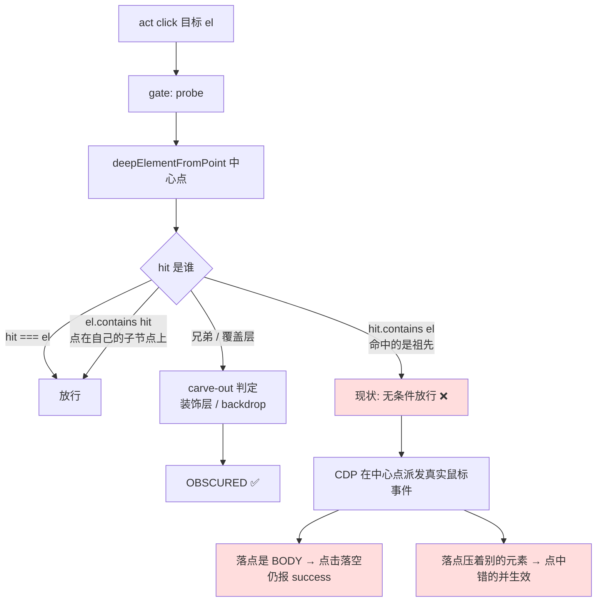

# 实现思路：命中目标祖先时不再无条件放行（P0-1a）

对应诊断：`EVAL-xiaoe-6-issues-2026-08-15.md` §1a。**尚未选定路线，未动代码。**

## 0. 流程图



## 1. 目标与判据

1. 目标被祖先 `overflow:hidden` 裁剪时，act click **报 OBSCURED 并点名裁剪它的容器**，不再返回 `success:true`。
2. 现有三类放行场景逐字不变：`hit === el`、`el.contains(hit)`（点落在自己的子节点上）、已有的 carve-out（同 widget 装饰层、backdrop）。
3. 三条路径（gate / 合成 / CDP）判定结果一致——同一元素不会门放行而派发层拦、或反之。
4. 回归判据：spike 页 hidden/visible 双向对照 + `pnpm --filter extension test`（限 `--maxWorkers=2`）+ bench 不掉点。

## 2. 现状勘察

同一条判据存在**三份拷贝**，都带 `!topEl.contains(el)` / `hit.contains(el)`：

| 位置 | 代码 | 角色 |
|---|---|---|
| `packages/extension/src/page-side/actionability.ts:143` | `if (hit === el \|\| el.contains(hit) \|\| hit.contains(el)) return { ok: true }` | actionability 门 |
| `packages/extension/src/handlers/dom.ts:411-418` | `topEl !== el && !el.contains(topEl) && !topEl.contains(el) && …` | 合成 click 路径 |
| `packages/extension/src/adapter/cdp.ts:195-205` | 同上（`if (!force)` 内） | CDP realMouse 路径 |

后两处的 `isInteractiveEl` / `sameWidgetDecoration` carve-out 也是逐字复制（`cdp.ts:171-194` 与 `actionability.ts:151-170`）。

**昨天 `0f9db90` 的证伪有边界**：CHANGELOG 写「`vortex_act` 的 click 被怀疑与 `mouse_click` 同属静默假成功，核实后不成立——遮挡在合成路径与 CDP 路径各有一道硬门」。那次核实的是**兄弟遮挡**（门确实有效，本次对照实验复现了 `OBSCURED / blocker: div#ov`）；**祖先裁剪**这一路没验到，而它正好从三道门的同一个缺口穿过去。

`0f9db90` 已经给 `blocker === "elementFromPoint=null"` 单独分流，措辞就是「clipped by an ancestor, or positioned outside the viewport」——说明"祖先裁剪"这个概念已进入错误话术，只是当时对应的是 hit 为 null 的情形，没覆盖 hit 为祖先的情形。

## 3. 候选路线

### B. 取消 `hit.contains(el)` 放行（收紧判据）

命中祖先一律进入后续 carve-out 判定，不满足即 OBSCURED，消息点名该祖先。

- **为什么行得通**：命中祖先只有三种成因——祖先裁剪、`pointer-events:none`、祖先自身覆盖在上层。三种情况下点击都到不了 el，放行本身就是错的。
- 代价：三处同步改；需抽共享纯函数，否则第四次复制迟早再漏一处。
- 失效条件：存在"命中祖先但点击确实能到达 el"的 UI 模式（如原生 `<option>`、某些 `pointer-events` 转发写法）——列入待验证。

### C. 保留放行，但加祖先裁剪几何校验（只堵裁剪族）

`hit.contains(el)` 时，逐级检查 el 到 hit 之间 `overflow != visible` 的祖先，中心点若落在其 clip 矩形外则判 OBSCURED。

- **为什么行得通**：精确命中本次根因，其他假放行维持现状，回归面最小。
- 代价：要自己算几何（`border-radius` / `clip-path` / 嵌套滚动容器都得考虑），比 B 复杂得多；`clip-path` 只靠 rect 算不出来。
- 失效条件：`clip-path` / `mask` 造成的裁剪测不出；`pointer-events:none` 的假放行照旧。

### D. 不设门，派发前照命中元素（诚实表征）

照 `5212180` 给 `mouse_click` 的做法：不拦，但把实际命中元素随结果返回（`hit: { el: "BODY", … }`），让调用方自己判断。

- **为什么行得通**：与刚落地的 `mouse_click` 决策同构，零回归风险。
- 代价：**P0 危害没有消除**——静默做错事变成"带字段地做错事"，模型多半不读 `hit` 字段。且 `mouse_click` 是坐标点击（用途就是绕过门），act 是高层语义动作，本来就承诺有门，两者定位不同。
- 失效条件：调用方不检查返回字段时完全无效。

## 4. 取舍与选定（建议 B）

- **放弃 C**：它把"能不能点到"退化成"我们能不能算出裁剪几何"。`clip-path`、`mask`、嵌套滚动容器各要一套算法，而浏览器的 hit-test 已经把这些全考虑过了——命中结果就是权威答案，重算一遍只会得到一个更差的近似。且它留着 `pointer-events:none` 那一路假放行不管。
- **放弃 D**：act 的契约里有 actionability 门，`success:true` 意味着"动作达成"。在这个契约下只加字段不拦截，等于把判断责任推给调用方，而本次事故正是调用方（模型）无法从返回值判断真伪造成的——30 天日志里也没有任何证据表明模型会读 `extras` 类字段（`0f9db90` 的 blocker 就是因为塞进 `context.extras` 而永远没被看见）。
- **选 B**：根因是判据本身过宽，就在判据上修。附带把三份拷贝收敛成一个共享纯函数——这套"命中归属"知识已经在 actionability / dom / cdp 各存一份，同一族知识在本仓库已经三次因为固化在单个调用点而复发（`actionability.ts:246` 的 hidden-rAF、`click-effect.ts:494` 的 timer-throttle，以及本条）。

## 5. 改动地图

```
packages/extension/src/page-side/
  hit-ownership.ts        ← 新增：命中归属纯函数（唯一真源）
                             输入 (el, hit) → { ok } | { ok:false, blocker, kind:"ancestor-clip"|"overlay" }
                             含现有 carve-out：同 widget 装饰层、backdrop
  actionability.ts:136-230  receivesEvents 改为调用它
  shadow-walk.ts            不动（deepElementFromPoint 继续提供 hit）

packages/extension/src/handlers/dom.ts:411-418     合成路径改调用（page-side 注入，注意模块作用域丢失问题）
packages/extension/src/adapter/cdp.ts:171-205      CDP 路径改调用（同上）

packages/shared/src/errors.hints.ts                OBSCURED hint 增祖先裁剪分支话术
packages/extension/src/action/auto-wait.ts:126-175 超时消息复用 0f9db90 的点名机制
```

数据流不变：仍是 `probe → hit-test → 判定 → 派发`，只有"判定"那一步的实现从三份拷贝变成一处调用。

**注入陷阱**：`dom.ts` / `cdp.ts` 两处是 `executeScript` 注入的 page-side func，会丢模块作用域（见 `js.ts:87-88` 的既有注释与 `vortex_page_side_func_inline_gotcha` 教训）。共享只能经 `loadPageSideModule` 挂 `window.__vortexHitOwnership`，或保持内联但由同一份源码生成——路线选定后需要先定这一点，否则会写出"单测绿、注入后 `X is not defined`"的假修复。

## 6. 被证伪的直觉

| 直觉 | 证伪依据 |
|---|---|
| act click 有硬门，不会静默假成功（`0f9db90` CHANGELOG 结论） | 本次实测：祖先裁剪场景 `success:true` 且 onclick 未触发；那次核实只覆盖兄弟遮挡 |
| 用 `elementsFromPoint` 取完整命中链来判定更权威 | 链里包含被遮挡的下层元素，兄弟遮挡场景会被放行——比现状更松，出局 |
| 这是 swiper/轮播的特例 | 与轮播无关：任何 `overflow:hidden` + 位移/裁剪都触发，spike 页是纯 CSS 复现 |
| 用户报告的"点击隐藏项生效"就是元素被点中 | 同一判据下更常见的是落点命中别的元素并生效——"错位一位"与此一致，但小鹅通现场未留证据 |

## 7. 待验证假设 —— 已实测（`scratchpad/spike-ancestor-hit.html`，路线 B 选定后）

**结论：B 无已知回归面。** 逐场景实测中心点 hit-test 归属：

| 场景 | hit 是谁 | 走哪条分支 | B 的影响 |
|---|---|---|---|
| 自定义 radio：`opacity:0` input 撑满 label | **INPUT 自己** | `hit === el` | **不受影响**（最担心的回归场景根本不走祖先分支——`opacity:0` 仍接收指针，`isVisible` 也刻意不看 opacity） |
| `label[for]` + 外部 input（`left:-9999px`） | `null` | `elementFromPoint=null` | 不受影响（已由 `0f9db90` 单独分流 + `centerOffscreen` 滚动） |
| 原生 `<option>` | BODY | 0×0 rect → `isVisible` 先拦 NOT_VISIBLE | 到不了这一步 |
| `pointer-events:none` 目标 | `DIV.row`（祖先） | `hit.contains(el)` | **应拦**（见下） |
| 祖先 `::after` 覆盖 | `DIV#cp`（祖先） | `hit.contains(el)` | **应拦** |
| 祖先 `overflow:hidden` 裁剪 | `DIV.row`（祖先） | `hit.contains(el)` | **应拦** |

**三种祖先命中场景在 realMouse 下全部落空却报 success**（决定性对照，`useRealMouse:true`）：

```
act #penbox   → { success: true, x: 253.5, y: 130.0, mode: "realMouse" }
act #covered  → { success: true, x: 69.0,  y: 207.6, mode: "realMouse" }
页面监听器实际收到：window.__hits === []      ← 一个 click 都没有
```

**顺带发现两条（与 B 的判据无关，单独记）**：

1. **同一 act click 在两个 tab 上走了不同路径**：未传 `useRealMouse` 时，一个 tab 全程 `mode:"realMouse"`（返回带 x/y/mode），另一个 tab 走合成（返回带 `element.id`、无坐标）。路径选择目前由 `args.trustedMode`/`useRealMouse` 决定（`dom.ts:238,283`），为何同会话不同 tab 表现不同**尚未归因**——不阻塞 B（两条路径都要改），但会影响回归测试怎么写。
2. **合成路径 `element.click()` 绕过一切 hit-test**：同样三个场景在合成路径下全部"点中"（`__hits` 有记录）。所以 B 修好之后，合成路径的行为会从"点得到但真实用户点不到"变成"报 OBSCURED"——这是语义收紧，需要在 CHANGELOG 里写明，并确认 bench 里没有用例依赖旧的宽松行为。

**仍待验证**：
- 共享方式：`loadPageSideModule` 能否覆盖 `cdp.ts` 那条路径（`resolve` 不可用时降级到 `document.elementFromPoint`，此时共享函数是否仍可达）。
- bench 是否有用例依赖当前宽松判据（改完必须全跑，不能只跑相关用例）。
