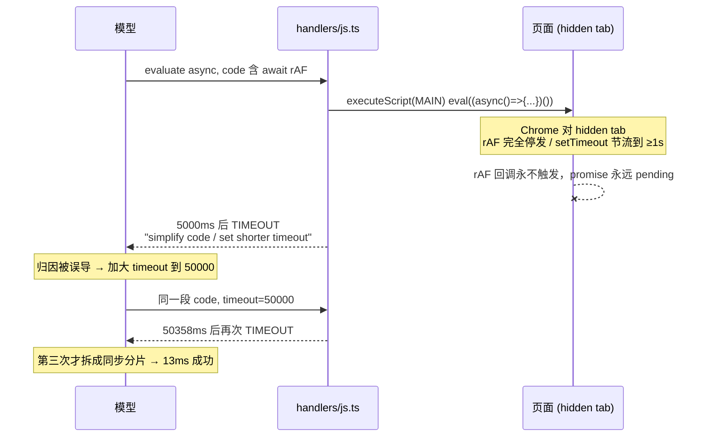

# 诊断：hidden tab 上 async evaluate 冻结 —— 2026-08-15 使用日志

窗口 2026-08-14→08-15，2 会话 / 133 次 vortex 调用，错误率 6.7%（9/133）。
量化基线：`reports/_eval/baseline/2026-08-15-today-0815.{json,md}`

## 今日 9 个错误的分类判定

| # | 错误 | 次数 | 判定 |
|---|---|---:|---|
| 1 | `evaluate TIMEOUT` | 3 | **工具层缺陷（P0）**，本文主题，共烧 105s |
| 2 | `evaluate INVALID_PARAMS: timeout 90000 > 60000` | 1 | P0 的**派生行为**：模型为绕开卡顿而加码超时 |
| 3 | `act NOT_ATTACHED` / `SELECTOR_AMBIGUOUS` / `INVALID_SELECTOR` | 3 | 非缺陷：猜 CSS 未先 observe，工具报错准确且 <2.3s 快失败 |
| 4 | `evaluate JS_EXECUTION_ERROR` | 2 | 非缺陷：用户页面侧代码自身错（fetch 拿到 HTML / Vue 内部结构猜错） |

## 0. 实现流程图

## 1. 目标与判据

1. hidden tab 上 `async` + `requestAnimationFrame` 的 evaluate **不再挂到超时**，返回耗时与 visible 同量级（<100ms）。
2. 仍然挂住时（rAF 之外的等待，如 timer 节流），TIMEOUT 错误必须**点名 tab 处于 hidden 及其后果**，而不是让模型去"简化代码"。
3. visible tab 行为逐字不变（rAF 语义不被改写）。
4. 回归判据：真浏览器 spike，hidden/visible 双向对照各跑一次。

## 2. 现状勘察

**注入与超时链路**
- `packages/extension/src/handlers/js.ts:283` — `timeout` 默认 `5000`，上限 `MAX_INNER_TIMEOUT_MS`（`packages/shared/src/timeout.ts:20` = 60000）。
- `packages/extension/src/handlers/js.ts:446` — `chrome.scripting.executeScript` 注入 `func`，页面侧用 `eval((async () => { code })())` 包装，**用户代码直接拿到页面全局的 rAF/setTimeout**。
- `packages/extension/src/handlers/js.ts:508` — `withTimeout(execPromise, timeout, "js.evaluateAsync")`。
- `packages/extension/src/handlers/js.ts:17-25` — 超时文案：`page-side func may still be running; set shorter timeout, simplify code, or use vortex_navigate to clear the tab`。**文案里没有任何 tab 可见性线索。**
- `packages/extension/src/content.ts:28` `evalAsyncInPage` — content-script 那条注入路径同样无保护（`new Function` 包装）。

**同一坑在别处已修过两次（知识没有上升为共享机制）**
- `packages/extension/src/page-side/actionability.ts:246` — `isStable` 在 `visibilityState === "hidden"` 时**跳过 rAF 采样**，注释写明"实测后台单次 rAF 5000ms 内从未回调、前台 8ms"（2026-06-09 京东搜索真因）。
- `packages/extension/src/page-side/click-effect.ts:494` — `end()` 在 hidden 时改走 `MessageChannel` busy-poll，绕开 background timer-throttle（N0041，实测 16017ms→308ms）。

## 3. 实机复现（对照组齐全，2026-08-15 本机 Chrome）

| 条件 | 代码 | 结果 |
|---|---|---|
| 后台 tab（`visibilityState:"hidden"`） | `await new Promise(r=>rAF(()=>rAF(r)))`，timeout=4000 | **TIMEOUT 4000ms** |
| 前台 tab（`visible`, `hasFocus:true`） | 同上 | **12ms 返回** |
| 后台 tab | `setTimeout(r,0)` / `setTimeout(r,100)` | 0ms / **1546ms**（节流到 ≥1s） |
| 后台 tab | `await document.fonts.ready` | 1ms —— **证伪** fonts.ready 挂起的猜测 |

真实日志侧的同一对照：13:36 与 13:37 两次含 `await rAF` 的采集分别挂 5.2s / 50.4s；13:38 拆成同步分片后，同样 1374 个元素的 `getBoundingClientRect` 只要 **13ms**、styles 采集 **41ms**。

## 4. 归因分析

- **直接原因**：Chrome 对 hidden tab 停发 rAF、把 timer 下限压到 ~1s；用户 async 代码里的等待原语因此永不回调。
- **为什么工具层没挡住**：evaluate 注入层不感知 tab 可见性，把页面全局的 rAF/setTimeout 原样交给用户代码。
- **为什么修过两次仍复发**：hidden-tab 冻结的知识被固化在**两个具体调用点**（actionability、click-effect）内部，从未抽成注入层/诊断层共享的单一真源——与既往"探测/门必须共享纯函数"的教训同型。
- **为什么排查代价高**：超时错误把因果指向"你的代码太复杂"，模型据此加大 timeout（5000→50000→90000 被 `INVALID_PARAMS` 拒），三轮才误打误撞拆成同步分片。诊断信息错误 → 修复方向错误。
- **可观测性缺口**：调用记录里没有 tab 可见性，事后无法对 30 天 32 次"含等待原语的 TIMEOUT"做归因，只能对今天这 3 次 live 复现。

## 5. 规模（30 天窗口，用于判断投入）

`evaluate` 2148 次 → `async` 610 次（28%）→ 其中含等待原语 314 次（async 的 51%）。
`TIMEOUT` 52 次，其中 **32 次（62%）代码含等待原语**；async 成功但 >5s 的另有 77 次（疑似被 timer 节流拉长，未证实）。

## 6. 候选路线

**A. 只做诊断（点名 hidden）**
超时时补一次同步探测读 `visibilityState`，hidden 则改写错误为"tab hidden：rAF 已冻结、timer 节流 ≥1s"，并给处方（改同步 / 激活 tab / 用 `vortex_wait_for`）。
代价：用户仍要先挂满一个超时；只治诊断不治故障。失效条件：探测本身也挂（罕见，同步路径）。

**B. rAF 垫片 + 诊断（A 的超集）**
注入 wrapper 改为 `(async (requestAnimationFrame, cancelAnimationFrame) => { code })(shim, shim2)`，hidden 时 shim 走 `MessageChannel`/`setTimeout(0)` 立即回调，visible 时绑定原生 rAF（逐字不变）。叠加 A 的诊断兜底。
代价：只覆盖裸 `requestAnimationFrame(...)`，写成 `window.requestAnimationFrame(...)` 不生效；rAF 语义从"等一帧渲染"变成"等一次微任务轮转"——但 hidden tab 本来就不渲染，等下去只有超时。失效条件：用户代码依赖 rAF 之后布局已刷新（hidden 下无论如何都不会刷新）。

**C. 执行前自动激活 tab**
检测 hidden + async 就临时切前台执行、完后切回。
代价：打断用户当前窗口、跨窗口/多显示器行为不可控、并发调用互相抢焦点。失效条件：用户正在别的 app 前台（macOS occlusion 仍判 hidden，切了也没用）。

## 7. 被证伪的直觉

| 直觉 | 证伪依据 |
|---|---|
| page-side 采集代码太重（475→1374 元素）所以慢 | 同逻辑同步版 13ms / 41ms |
| 默认 5000ms 超时太短是主因 | 给到 50000ms 仍然超时，长度与根因无关 |
| `document.fonts.ready` 在 hidden 挂起 | 实测 1ms resolve |
| `timeout > 60000` 被拒是独立的参数问题 | 它是 P0 的派生：模型在为一个不会结束的等待加码 |

## 8. 待验证假设

- 30 天 32 次含等待原语的 TIMEOUT 中，`setTimeout` 那 29 次是否同因于 timer 节流 —— 缺 visibility 记录，**未证实**。
- `MessageChannel` 垫片在真实站点（CSP / Trusted Types 页面）的兼容性 —— 需 live spike。
- content-script 路径 `content.ts:28` 是否也在被使用 —— 需确认调用方后再决定是否同步改造。
