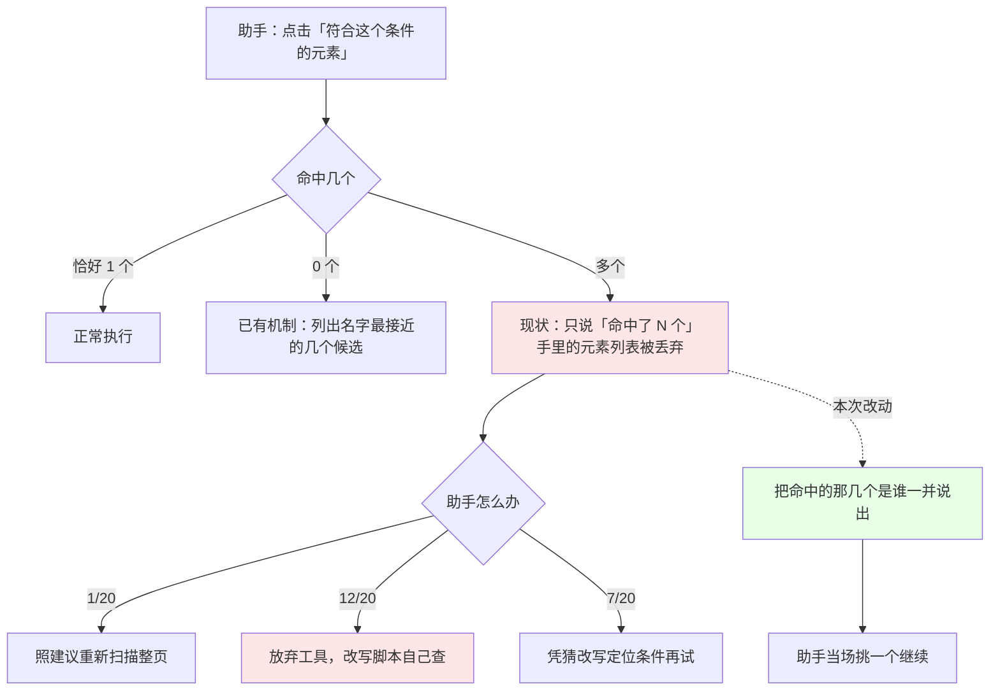

# 实现思路：元素定位失败时，把工具已经知道的答案告诉调用方

来源：`reports/_usage-mining/2026-08-28-act/FINDINGS-luna.md`（codex luna 恢复轨迹分析）
作者：Claude Opus（第 2 阶段）

## -1. 一页纸

- **改什么**：当自动化助手指定的元素定位条件同时命中多个元素时，工具会拒绝操作并让它「换个更精确的写法，或者重新扫描整个页面」——但工具此刻**手里就攥着那几个命中的元素**，却一个都不说。本次让工具把命中的是哪几个直接讲出来。
- **为什么现在改**：最近 14 天的真实使用日志里，这类失败发生 20 次、跨 10 个不同会话。失败后助手照工具建议去重新扫描页面的只有 1 次，另外 12 次直接放弃工具、改用写脚本自己查页面。**建议没人听，不是因为助手不听话，而是因为照做比自己查更贵。**
- **改完谁会感觉到什么不同**：自动化助手在定位撞车时，当场就能看到命中的是哪几个元素、各自长什么样，直接挑一个继续；不必再为了搞清楚"到底是哪两个"而把整页重新扫一遍或改写成脚本。
- **本次明确不解决什么**：不改变工具的入参写法，不新增参数；不碰元素被遮挡、页面卡顿这两类失败（日志证据表明它们是页面自身状态，工具的说明已经正确）。
- **不改会怎样**：助手继续绕开这个工具去写脚本查页面。这条绕行路线不受工具的安全检查保护，出问题时也更难查——等于工具的招牌能力在真实使用中被自己的错误提示劝退。
- **影响面与风险**：只改失败时说什么，成功路径一个字节都不动。风险有两条：一是把页面上的文本放进错误说明，可能带出用户不想外传的内容，需要限长并只取用于辨认的最小信息；二是同一条错误说明会变长，占用回传预算。

## 0. 实现流程图

## 0.5 问题重定义

**表象**：`act` 的 `SELECTOR_AMBIGUOUS` 在 14 天内 20 次、`NOT_ATTACHED` 8 次，上一轮全被判为「调用方误用」。

**真正失效的机制**：不是调用方误用，是**工具把自己已经完成的工作扔掉了**。多命中分支在 `packages/extension/src/handlers/dom.ts:362-371` 拿到了完整的 `els` 数组，却只回传 `extras: { matchCount: els.length }` —— 元素列表当场丢弃。于是错误只能说"命中了 2 个"，说不出"是哪 2 个"。调用方要补上这个信息，只有两条路：重新扫描整页（贵、慢、还要自己从全页结果里找那 2 个），或者写一行脚本自己查（便宜、直接）。**日志里 12/20 选了后者，这是理性选择，不是误用。**

**约束逐条分类**：

| 约束 | 分类 | 依据 |
|---|---|---|
| 多命中时必须拒绝操作，不能替调用方猜一个点 | **物理必然** | 点错元素不可逆；`dom.ts:365-371` fail-closed 是对的，本次不动 |
| 候选信息必须放进错误正文才能到达调用方 | **物理必然** | `formatDispatchError`（`packages/mcp/src/lib/dispatch-error.ts:13-32`）只渲染 `code`/`message`/`hint`，`extras` 除 `lastReason` 外不出现在回传文本里 |
| 错误只说数量、不说是哪几个 | **历史习惯** | 同仓零命中路径 `dom.ts:153-168` 的 `buildNoMatchError` 已经会收集并列出候选；多命中只是没做，不是做不了——而且多命中比零命中更容易，元素就在手里，不需要扫全页 |
| 调用方应当去调用另一个工具来消歧 | **历史习惯** | `errors.hints.ts` 的 hint 这么写；但 `candidate-suggest.ts:73-76` 的注释已经承认过同类建议的失效："日志实测同 target 重试成功 0 次，那条建议把 agent 引向死路（**它随后普遍逃向 vortex_evaluate 手写匹配**）" |

**反事实**：若去掉"错误只说数量"这条历史习惯，调用方不再需要为了辨认候选而离开工具——`SELECTOR_AMBIGUOUS` 的转 evaluate 动机整类消失。→ 真正的问题是错误信息丢弃了已有信息，20 次失败只是它的投影。

**本次修根因还是修症状**：**修根因**。根因就是信息在抛错点被丢弃，修法就是不丢。

## 1. 目标与判据（v2，按审核意见重写）

1. **摘要覆盖率**：多命中失败的错误正文为**每个命中元素**给出受预算约束的可辨识摘要（超出候选数上限时保留总数与被省略数量）。
2. **同形降级**（v2 拆分，原判据自相矛盾）：摘要足以区分时，调用方可直接据此改写定位条件；**摘要仍完全同形时，正文必须明确报告"无法仅凭摘要区分"**，继续 fail-closed。
   - 原 §1.1 写的"使调用方无需再发起任何额外调用即可分辨它们"是**绝对化的错误判据**：§3 自己已承认候选可能同形，`div.relative.aspect-video` 的 11 个命中很可能共享 class、无自身文本、无唯一属性。路线 A 不提供可直接使用的定位串，就不能承诺"必然可消歧"。验收按"每个候选有摘要"判，**不按"必然可消歧"判**。
3. 摘要内容对页面文本限长截断，**且长度约束是实现前的硬约束而非待验证项**（见 §5）。
4. 成功路径行为与输出**逐字节不变**，且有可执行回归断言（每种动作至少一个单命中成功样本，比对改动前后的返回对象与副作用），不是只列为目标。
5. 六处抛出点（`dom.ts:368` / `:724` / `:1032` / `:1209` / `:1585` / `:1978`）**错误契约一致，但查询语义必须保持各自原样**——前五处 `queryAllDeep` 穿 open shadow，**第六处 `document.querySelectorAll` 只查 light DOM**（`dom.ts:1972`，审核指出并核实成立）。不得把第六处误改成深度查询。
6. **逐出口变异验证**：分别删除**每一个**出口的摘要拼接，对应出口的断言必须失败。只删共享 builder 的摘要**不满足**本判据——那证明不了六处都真的接上了。
7. 页面侧注入逻辑的测试必须**复刻实际传给 `chrome.scripting.executeScript` 的函数及参数**，用 `new Function` 剥离模块作用域后运行，验证函数体不依赖模块变量、闭包变量、未注入的 helper 或不可序列化对象。只把一个纯函数包进 `new Function` **不足以**证明六处实际注入函数可运行（审核指出，成立）。

## 2. 现状勘察

- **多命中抛出点**：`packages/extension/src/handlers/dom.ts:362-371`（CLICK 探测阶段）拿到 `els = queryAllDeep(sel)`，`els.length > 1` 时返回 `{ errorCode: "SELECTOR_AMBIGUOUS", error: 'Selector "..." matched N elements', extras: { matchCount } }`。同形状代码另见 `:724`、`:1032`、`:1209`、`:1585`、`:1978`，共 6 处。
- **零命中已有的对照实现**：`dom.ts:153-168` 的 `buildNoMatchError` → `rankCandidates` + `buildNoMatchMessage`（`packages/extension/src/action/candidate-suggest.ts:61-88`），把候选写进 **message 正文**而非 extras。这既是可复用的呈现范式，也证明"候选进正文"这条路已被走通。
- **回传通道**：`packages/mcp/src/lib/dispatch-error.ts:13-32` 只渲染 `code`/`message`/`hint`（`extras` 仅 `lastReason` 参与拼 hint）。所以候选必须进 message。
- **入参面**：`packages/mcp/src/tools/schemas-public.ts` 的 `vortex_act` 只有 `target`（`@ref` 或 CSS selector），无索引类参数。
- **既有 selector 生成能力**：`packages/extension/src/handlers/observe.ts:1952` 的 `buildSelector` 具备 id 唯一性判断、shadow 戳记（`stampRid`）等阶梯，但它**内联定义在 page-side 注入函数内部**，不是模块级可复用函数——复用需要先抽出，属于独立重构。
- **日志侧事实**（`FINDINGS-luna.md`）：`SELECTOR_AMBIGUOUS` 20 条 / 10 会话，后续第一步 `evaluate` 12、`act` 7、`press` 1，后续 6 次内出现 `observe` 仅 1 条；`NOT_ATTACHED` 8 条 / 5 会话，后续 `evaluate` 7、`observe` 0。

## 3. 候选路线

### 路线 A：错误正文补全候选摘要（呈现层）

- **切入点**：6 处多命中抛出点，把 `els` 映射成摘要数组，交由与 `buildNoMatchMessage` 同风格的构造函数生成正文。
- **摘要取什么**：标签名 + 可访问名或截断后的文本 + 关键区分属性（如 `href`/`id`/`data-*` 中已出现在原 selector 里的那类）+ 是否可见。
- **为什么行得通**：直接消灭"要辨认候选就得离开工具"这个动机，且零命中路径已验证过这条呈现通道。
- **代价**：错误正文变长；摘要仍需调用方自己转写成新的定位条件。
- **什么条件下会失效**：多个候选在摘要维度上完全同形（同标签、同文本、无区分属性）时，摘要帮不上忙——需要落到位置或顺序信息。
- **业务侧差别**：改动最小、当天可交付、不动任何契约；助手仍需自己写出新的定位条件，但不必再离开工具去查。

### 路线 B：候选摘要 + 可直接使用的定位串（定位语法层）

- **切入点**：在 A 的基础上，为每个候选生成一个**当场可用的区分性定位串**，调用方复制即可继续。
- **为什么行得通**：把"辨认"和"改写"两步都消化掉，调用方零推断。
- **代价**：需要先把 `observe.ts:1952` 的 `buildSelector` 从 page-side 内联抽成共享纯函数（本仓已识别过该复用需求），是一次独立重构；且该函数在 shadow 场景走 `stampRid` 戳记，会**写入页面 DOM**，在纯失败诊断路径上引入副作用，需要评估是否可接受。
- **什么条件下会失效**：生成的定位串自身仍可能多命中（`observe.ts:1958-1960` 的注释已承认这种回退："多命中则 SELECTOR_AMBIGUOUS"）——若不加唯一性校验，等于把同一个问题推后一轮。
- **业务侧差别**：助手体验最好（复制即用）；但上线最慢，且诊断路径写 DOM 这件事本身需要单独论证。

### 路线 C：新增索引类入参（工具契约层）

- **切入点**：`vortex_act` 增加索引参数，多命中时提示"传索引选第几个"。
- **为什么行得通**：不需要生成任何 selector，调用方一个数字就能消歧。
- **代价**：改公开工具面，占 `tools/list` 字节预算（本仓有明确预算约束）；且索引语义脆弱——DOM 顺序在两次调用之间变化时，索引会静默指向另一个元素，把"拒绝操作"的安全性换成了"可能点错"。
- **什么条件下会失效**：动态列表、异步渲染场景下顺序不稳定，即高频场景。
- **业务侧差别**：调用方最省事，但把不可逆的点错风险重新引了回来——与本仓 fail-closed 的既有取向冲突。

## 4. 取舍与选定

**已由用户选定：路线 A**（2026-08-28）。

放弃 B 作为本轮主路线的具体理由：它的收益（省掉调用方一次改写）建立在一次跨模块重构 + 在纯诊断路径上写页面 DOM 之上；而 `observe.ts:1958-1960` 自己承认生成的 selector 仍可能多命中，不加唯一性校验就是把问题推后一轮。A 已经消灭了"必须离开工具"这个根因动机，B 的增量收益不足以在同一轮里承担这些代价——它更适合在 A 落地、拿到新一轮日志验证转 evaluate 率确实下降之后再评估。

放弃 C 的具体理由：索引在动态列表下不稳定，会把当前"拒绝操作"的安全性换成"可能点错不可逆元素"，与 `dom.ts:365-371` fail-closed 的既有取向直接冲突；且要占公开工具面预算。

## 5. 改动地图（v2）

**分层边界**（审核建议，采纳）：page-side 注入函数负责从**已命中的 `els`** 立即生成裁剪后的可序列化 DTO（tag / 可访问名 / 截断文本 / 白名单属性 / 可见性 / 顺序）；host 侧纯函数只接收 DTO 数组组装 message。这样文案可单测，又不会把 Element、闭包 helper 或跨 world 对象传给 host。

**必须用已命中的 `els` 生成摘要，不得在错误分支之后重新 query**——DOM 变化时重查的结果可能不是触发拒绝的那一批（审核指出）。

- `packages/extension/src/action/candidate-suggest.ts`：新增多命中正文构造 + DTO 组装纯函数，与 `buildNoMatchMessage` 并列同风格。注意其既有 `NameCandidate` 只有 `name/tag`，**不能直接代表已命中的 Element**，可借鉴的是排序/文案范式而非数据结构。
- `packages/extension/src/handlers/dom.ts`：6 处多命中分支改为携带 DTO；第六处保留 `document.querySelectorAll` 的 light-DOM 语义。
- `packages/shared/src/errors.hints.ts`：`SELECTOR_AMBIGUOUS` 默认 hint 改为指向"从正文候选中选取并改写定位条件"，不再单推"再 observe"。该文件顶部注释要求 hint 含 next-action 动词与工具名/参数关键词；该码当前 `recoverable: true`，**文案与 recoverable 语义都要补测试**。摘要无法区分时，正文与 hint 都不得暗示"已有唯一目标"。

### 长度与隐私：硬约束（v2 升级，原为待验证项）

**错误正文没有任何长度兜底**——`packages/mcp/src/server.ts:923-930` 的 action 错误路径直接 `formatDispatchError(resp.error)` 返回，而 `RESPONSE_SIZE_LIMIT` 截断只存在于成功结果路径 `:1092-1098`（审核指出，已核实）。所以预算必须由本次实现自己保证：

1. 对可访问名、文本、属性值**分别**设上限，并对**整个候选段与整条 message** 设总字节上限——不能只限单个文本字段。
2. 属性不无条件搬运：按**原 selector 中出现过的属性做白名单**，属性名与值分别截断，清洗换行与控制字符。
3. 设候选数量上限；超限时保留**命中总数**与**被省略数量**，避免正文看起来像完整列表。
4. `div.relative.aspect-video` 的 **11 个命中必须有测试**，不能只测 2 个候选。

不得把仓库既有的 query 序列化字段（`dom.ts:185-200`、`:212-237`）原样搬进错误正文——`QUERY_ALL` 允许最多 100 个元素且属性无总量预算，那套实现不满足错误正文的隐私与大小约束（审核指出）。

### 测试清单（审核要求，实施方须逐条落实）

1. **集成级**：候选在 message 时最终 MCP 文本可见；候选只在 `context.extras.candidates` 时最终文本**不可见**；`lastReason` 的既有 TIMEOUT hint 行为不被破坏。
2. **纯函数**：空字段、引号/换行/Unicode、超长文本、属性值清洗、总预算、同形候选、2 个与 11 个候选；断言保留 `matched N` 与省略计数。
3. **注入**：六个 page-side 函数分别以 `new Function` 剥离模块作用域后运行；前五个用 shadow-root fixture，第六个用 light-DOM fixture；验证摘要来自已命中集合而非二次查询。
4. **六出口**：各自返回 `errorCode: SELECTOR_AMBIGUOUS`、原数量信息、message 含摘要；第六处单独断言未改变 light-DOM 查询语义。
5. **逐出口变异**：分别删除六处的摘要拼接，对应出口测试必须转红。
6. **成功回归**：每种动作至少一个单命中成功样本，比对改动前后 payload 与副作用。

**保持 fail-closed**：候选摘要只用于诊断，不得自动挑第一个，也不得因摘要失败把多命中降为成功。

## 6. 被证伪的直觉

1. **"调用方不照 hint 做是使用习惯问题"** —— 被 `candidate-suggest.ts:73-76` 的既有注释直接证伪：本仓早已实测到同类建议"把 agent 引向死路，它随后普遍逃向 vortex_evaluate 手写匹配"，并已为零命中路径修复。这不是习惯，是设计。
2. **"多命中比零命中更难给候选"** —— 证伪：零命中要靠 `collectNameCandidates` 扫全页再按名字相似度排序（`candidate-suggest.ts:61-71`），多命中的元素在 `dom.ts:362` 就已在手里，反而更容易。
3. **"候选信息可以放进 `extras` 传出去"** —— 证伪：`dispatch-error.ts:13-32` 只渲染 `code`/`message`/`hint`，`extras` 除 `lastReason` 外不进回传文本；零命中路径也正是把候选写进 message 的。
4. **"可以复用 observe 的 `buildSelector` 直接生成定位串"** —— 部分证伪：它内联在 page-side 注入函数内（`observe.ts:1952`），不是模块级函数，复用需先重构；且 shadow 分支会 `stampRid` 写 DOM。

## 7. 待验证假设

| 假设 | 状态 | 谁确认、怎么确认 |
|---|---|---|
| 补全候选后，转 `evaluate` 率会下降 | **推的** | 只能靠改动上线后的新一轮日志挖矿比对，本轮无法证明；不作为验收判据 |
| 摘要能区分日志中那 20 条的实际候选 | **推的，可离线验证** | 实施方：取日志里的真实 selector 与页面，检查摘要是否足以分辨；至少覆盖 `a[href="/frontend"]` 与 `div.relative.aspect-video` 两条真实样本 |
| `extras` 不出现在回传文本中 | **实查** | `packages/mcp/src/lib/dispatch-error.ts:13-32` |
| 六处抛出点形状一致、可统一改造 | **实查** | `dom.ts:368/724/1032/1209/1585/1978` |
| ~~页面文本进错误正文的隐私与长度风险~~ | **已升级为硬约束** | 见 §5「长度与隐私」；审核指出错误路径无 `RESPONSE_SIZE_LIMIT` 保护（`server.ts:923-930` vs `:1092-1098`），已核实成立 |
| 六处抛出点查询语义是否一致 | **实查，结论修正** | 前五处 `queryAllDeep` 穿 shadow，第六处 `document.querySelectorAll` 只查 light DOM（`dom.ts:1972`）——原方案"六处形状一致"过宽 |

## 8. 审核返工记录（2026-08-28）

审核结论：**有条件通过**。核心事实（候选在抛出点被丢弃、候选必须走 message 而非 extras、零命中路径可借鉴、路线 A 成立）全部经源码核对为真。以下必改项已落实：

1. **§1 判据自相矛盾**：原第 1 条承诺"无需额外调用即可分辨"，与 §3 承认的"候选可能完全同形"冲突。已拆成「摘要覆盖率」+「同形降级」两条，明确不按"必然可消歧"验收。
2. **六处并非语义一致**（审核新发现，已核实）：第六处走 `document.querySelectorAll` 只查 light DOM，其余五处 `queryAllDeep` 穿 shadow。已写入判据与改动地图，禁止误统一。
3. **错误正文无长度兜底**（审核新发现，已核实）：`RESPONSE_SIZE_LIMIT` 只保护成功路径。隐私与长度已从"待验证假设"升级为实现前硬约束，含分字段上限、总预算、白名单属性、候选数上限与省略计数。
4. **变异验证粒度不足**：改为逐出口变异，只删共享 builder 不算数。
5. **`new Function` 要求不充分**：改为复刻实际传给 `executeScript` 的函数及参数，验证不依赖模块/闭包变量与不可序列化对象。
6. **纯函数输入边界未定义**：改为 page-side 生成裁剪 DTO、host 侧纯函数组装，禁止把 Element 传给 host；并明确禁止在错误分支后重新 query。
7. **hint 未给确切恢复动作**：已要求新 hint 指向"从正文候选中选取并改写定位条件"，并为文案与 `recoverable` 语义补测试。
