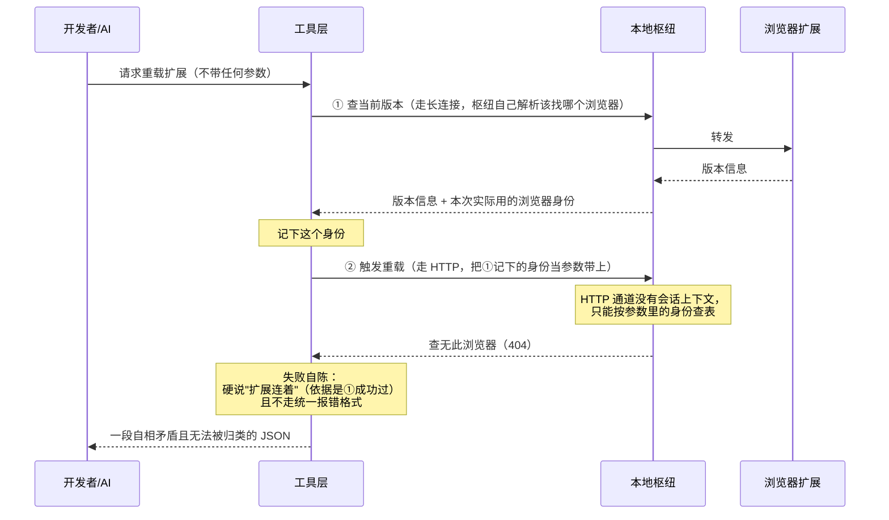

# 实现思路：开发者重载扩展时的失败自陈与身份传递

来源：`reports/_usage-mining/2026-08-28/FINDINGS-luna.md`（codex luna 日志分析）
作者：Claude Opus（第 2 阶段）

## -1. 一页纸

- **改什么**：开发者在调试时手动重载浏览器扩展，这个动作偶尔失败；失败时给出的说明既自相矛盾（一边说浏览器连着、一边说找不到这个浏览器），又不符合其他所有工具统一的报错格式，导致既看不懂、也没法被统计工具归类。本次修正它的失败自陈方式，并重新审视"由调用方指定重载哪个浏览器"这条设计是否必要。
- **为什么现在改**：真实使用日志（最近 14 天）里这个动作失败了 3 次，每次都给出误导性说明，把排查引向"扩展是不是没装好"这个错误方向——而当时扩展是好的。
- **改完谁会感觉到什么不同**：只有开发者自己（含 AI 助手）在调试扩展时会感觉到：失败时能立刻看懂是什么原因、该做什么；错误统计表里这类失败不再落进"无错误码"的黑洞。
- **本次明确不解决什么**：不解决"浏览器身份为什么会在两次请求之间失效"这个根本机制——它没被坐实，本轮只做到不再谎报。不动任何面向最终用户的工具。
- **不改会怎样**：这个动作继续偶发失败并给出误导性说明；日志挖掘时这类失败继续隐形（被归为无错误码），下次还得重新查一遍。
- **影响面与风险**：极小。这是仅在开发模式下开放的工具，普通使用者拿不到它。风险点只有一个：它的失败输出格式会变，若有脚本按现在的 JSON 结构解析这段输出，会受影响。

## 0. 实现流程图

## 0.5 问题重定义

**表象**：重载扩展失败，返回 `未知 browser: <uuid>`，同时 hint 说"扩展连着(当前绑定 <同一个 uuid>)"。

**真正失效的机制（分两层，第二层未坐实）**：
1. **已坐实**：失败说明本身不可信。hint 里"扩展连着"不是当刻观测，而是**从几百毫秒前第①步成功这一事实硬推出来的断言**（`packages/mcp/src/server.ts:441-444`）。枢纽此刻的真实回答是"我表里没有这个浏览器"，两句话冲突时读者无从判断信谁——实际把排查引向了错误方向。
2. **未坐实**：浏览器身份为何在第①步与第②步之间失效。日志显示两次失败前都有长时间空闲（12 分钟 / 3 分钟），且其中一次的 3 分钟前刚成功重载过一次。**本次不假装知道答案。**

**约束逐条分类**：

| 约束 | 分类 | 依据 |
|---|---|---|
| HTTP 触发通道拿不到会话身份，只能按参数查表 | **物理必然** | `packages/hub/src/http-routes.ts:214` 走 `selectBrowser(options, requestedBrowserId)`，入口是无状态 HTTP，没有会话概念 |
| 多个浏览器同时在线时枢纽拒绝"不指定" | **物理必然（在该通道内）** | `http-routes.ts:255-262`，两个以上在线且未指定即返回"browserId 必填" |
| 因此工具必须自己先查一次身份再带上 | **历史习惯** | `server.ts:415-418` 注释说"必须显式带 browserId"，但同文件 `http-routes.ts:195-213` 早就有 `all:true` 分支可以完全不带身份——2026-08-11 定这条时没走那条路 |
| 重载动作必须走 HTTP 而非长连接 | **历史习惯** | 长连接侧已有控制通道 `packages/hub/src/router.ts:118` + `browser-control.ts:3`，只是白名单里目前只有两个浏览器切换动作；重载被放在 HTTP 是当初的选择，不是能力限制 |
| 失败输出必须是 JSON 对象文本 | **历史习惯** | `server.ts:431-445` 手写 `JSON.stringify`，同文件其他工具走统一错误格式 |

**反事实**：若去掉"工具必须自己带身份"这条历史习惯（改由枢纽按会话解析，或走已存在的不指定分支），第②步就不再需要一个可能过期的身份参数，`未知 browser` 这类失败**整类消失**。→ 真正的问题是身份传递这条链路本身，当前表象只是它的投影。

**本次修根因还是修症状**：见候选路线——A 是纯症状修复（诚实自陈），C 是根因修复（拆掉身份传递），B 介于两者之间。取舍交由用户选择。

## 1. 目标与判据（v2，按审核意见重写）

1. `vortex_dev_reload` 的**全部三个失败出口**（`server.ts:436` / `:451` / `:489`）输出文本均以 `Error [CODE]: ` 开头，且 `CODE` 是 `packages/shared/src/errors.ts` 枚举内的合法错误码。
   - 当前 `RELOAD_TIMEOUT`、`RELOAD_TRIGGER_FAILED` **不在该枚举内**（`errors.ts:15-60` 无此两项），属于工具自造字符串，必须映射到合法码。
2. 失败说明里不再出现与枢纽当刻回答冲突的断言。具体到 `:441-444`：不得再在只知道"几百毫秒前取到过身份"的情况下宣称"扩展连着"。
3. 三个出口各有测试，断言粒度到**完整前缀 + 精确 code + message + hint + `isError === true`**，不接受只比键集合。
4. 通过**变异验证**（变异点、命令、预期见 §5）：把每个出口改回原行为，对应测试必须转红。
5. C2 的验证得出明确结论（判据见 §8）。**状态已统一**：直接机制（"reload 切断承载响应的那条连接"）已由源码排除，不再是待验证项；live 只确认**间接关闭与消息投递时序**——NM 断开触发的 `hubLink.stop()` 是否会在 agent-result 送达 hub 前清空 pending。

**已删除的原判据**（审核指出基于错误事实，核实成立）：原 §1 曾声称 `scripts/usage-baseline/collect.mjs` 能把失败归到具体错误码、当前归为 `NO_CODE`。实查 `collect.mjs` 只有 `errorSignature` 文本归一化（`:26-35`），**没有任何错误码提取逻辑**，仓库内也不存在 `NO_CODE` 实现——那是 codex luna 分析时自己临时脚本的分类，被我误当成采集器的能力。因此本轮**不设**与日志归类相关的判据，也不写对应的扫描类测试。修复后签名文本会变化是事实，但那不等于"按错误码归类"。

## 2. 现状勘察

**调用链**（`vortex_dev_reload` 入参恒为 `{}`）：

- `packages/mcp/src/server.ts:398-455` 是整个动作的实现，分三步：查版本 → HTTP 触发 → 轮询 buildStamp。
- 第①步 `server.ts:404-412`：`sendRequest("diagnostics.version", {}, PORT, undefined, 5000)`，从响应里取 `before.browserId` 存为 `boundBrowserId`；这一步失败只 catch 不中断。
- 第②步 `server.ts:415-425`：`POST /dev/reload-extension`，body 为 `boundBrowserId ? { browserId: boundBrowserId } : {}`。
- 失败分支 `server.ts:431-445`：手写 `JSON.stringify({reloaded,error,message,hint})`，hint 在 `boundBrowserId !== undefined` 时硬断言"扩展连着"。

**枢纽侧**：

- `packages/hub/src/http-routes.ts:214-222`：`selectBrowser(options, requestedBrowserId)` 成功后 `sendAgentCommand(browserId, "reload-extension")`。
- `packages/hub/src/http-routes.ts:239-272`：带身份但查不到 → 404 + `INVALID_PARAMS` + `未知 browser: <id>`；不带身份且多个在线 → 400 + "browserId 必填"。
- `packages/hub/src/http-routes.ts:195-213`：**已存在的 `all:true` 分支**，遍历所有在线浏览器逐个重载，完全不需要身份参数。
- `packages/hub/src/browser-match.ts:16-30`：`matchBrowser` **支持 uuid 精确匹配**（`exactId`），也支持标签匹配——所以传 uuid 本身并没有用错命名空间。

**长连接侧（路线 C 的落点）**：

- `packages/hub/src/router.ts:118` 把白名单内的动作交给 `handleBrowserControl`，该分支能拿到 `session` 并调用 `matchBrowser`（`router.ts:140-158`）。
- `packages/hub/src/browser-control.ts:3`：白名单当前只有 `browser.list` / `browser.select`。
- `packages/hub/src/router.ts:238`：普通请求走 `ensureBrowser(session, request)` 解析出本次实际使用的浏览器身份，成功响应回填的就是这个值——**不是会话上粘的旧值**。

## 3. 候选路线

### 路线 A：只让失败说清楚（契约层）

- **切入点**：`packages/mcp/src/server.ts:431-455` 的失败分支。
- **改动落在哪一层**：工具的输出契约层，不碰身份传递。
- **为什么行得通**：本轮唯一坐实的缺陷就是"失败自陈不可信 + 不可归类"；把输出改成统一 `Error [CODE]` 格式、把 hint 里的硬断言换成对当刻事实的陈述（例如"第①步曾成功取到身份 X，但枢纽现在查不到它"），这两条都不依赖未坐实的根因。
- **代价**：`未知 browser` 失败本身仍会发生，只是不再误导。
- **什么条件下会失效**：如果身份失效是高频且可自动恢复的，只改文案等于把可自动化的事推给人。
- **业务侧差别**：改动最小、当天可上线；开发者下次遇到时能立刻看懂，但仍需自己手动重试一次。出问题时对方看到的是一条明确的错误码 + 可执行指引。

### 路线 B：失败后重新解析并重试一次（调用层）

- **切入点**：`server.ts:415-430`，POST 收到 404/`INVALID_PARAMS` 时重查一次身份再发一次。
- **改动落在哪一层**：工具的调用编排层。
- **为什么行得通**：若身份确实是在两步之间失效，重查即可拿到新身份。
- **代价**：**这是给旧结构加兜底分支**——身份传递这条链路本身没变，只是多给它一次机会。命中了本仓治标信号表里的"方案主体是给旧结构加特例分支/兜底"。且在根因未坐实的前提下，无法证明重试一定能拿到有效身份（若失效原因是枢纽侧表项本身没更新，重试同样失败）。
- **什么条件下会失效**：身份失效不是瞬时竞态而是稳定状态时，重试只是把一次失败变成两次失败加一倍等待。
- **业务侧差别**：多数情况下开发者无感（自动恢复）；但一旦根因不是竞态，故障表现会变成"更慢地失败"，反而更难查。

### 路线 C：拆掉身份传递（通道层）

- **切入点**：两个变体。C1 = 改用已存在的 `http-routes.ts:195-213` 不指定身份分支；C2 = 把重载动作加进长连接控制白名单（`browser-control.ts:3`），由枢纽按会话解析该重载哪个浏览器，复用 `router.ts:140-158` 已有机制。
- **改动落在哪一层**：请求通道层，工具侧不再持有和传递浏览器身份。
- **为什么行得通**：`未知 browser` 只可能由"调用方带了一个查不到的身份"产生（`http-routes.ts:249-256`）。不带身份，这类失败整类消失，而不是被重试掩盖。
- **代价**：C1 语义变化——变成重载所有在线浏览器，而不是"当前绑定的那个"，多浏览器场景下会误伤；C2 要动枢纽的控制通道白名单与响应封装，改动面最大，且需要验证重载动作在长连接下的时序（重载会杀掉连接本身）。
- **什么条件下会失效**：~~重载动作会切断承载它的那条长连接，响应可能永远回不来~~ —— **v3 已由源码坐实推翻，见 §6 第 5 条**。剩余风险转为工程性：`router.ts:134-139` 会把未进白名单的控制动作按"需要 `params.browser`"处理并报 `browser is required`，所以仅把动作名加进 `browser-control.ts:3` 不够，必须写独立分支（审核指出）。
- **业务侧差别**：C1 上线最快但多浏览器开发者会被误伤（另一个浏览器被无故重载）；C2 上线最慢但之后这类问题不会再以任何形式出现，长期维护成本最低。出问题时对方看到的是连接中断而非错误码，诊断难度不同。

## 4. 取舍与选定

**已由用户选定：A + C2 spike**（2026-08-28）。即先按 A 让失败诚实可归类（当天可交付、零风险），同时对 C2 做一次 live 验证。**注意状态已变**：原先设想的"生死线 spike"（重载是否会切断自己的响应通道）已由源码排除（§6 第 5 条），live 验证的对象改为间接关闭与投递时序（§8）；验证通过再决定是否投 C2。

放弃 B 作为主路线的具体理由：在根因未坐实的约束下，重试无法被证明有效——归因第 3 问（改前改后行为在实际失败入参下是否真的不同）答不出来，只能靠"可能是竞态"这个未验证假设支撑。本仓历史上"修了一半比没修更危险，它制造已处理过的错觉"正是同一形状。

## 5. 改动地图（v2）

**实现要求（放行条件，不可省）**：调用 `formatDispatchError` 前必须有一层运行时 guard/normalize，而不只是把它写在下表的"理由"里。规则：`code` 非字符串或不在 `Object.values(VtxErrorCode)` 内 → `INTERNAL_ERROR`；`message` 缺失或非字符串 → 用合理占位（如 `reload trigger failed (HTTP <status>)`）。fetch 异常出口固定 `INTERNAL_ERROR` + 指向 vortex-server 的 hint，且测试要断言其语义（`recoverable: true`、指引是"检查 server 后重试"），不能只断言字符串相等。

**复用哪个格式化函数——原方案选错了。** `formatError`（`server.ts:80-85`）只在 `err instanceof VtxError` 时输出 `Error [CODE]`，否则退化成 `(err as Error)?.message`；而 HTTP 失败拿到的 `body.error` 是普通 JSON 对象，**永远命中不了那个分支**。正确的复用对象是 `packages/mcp/src/lib/dispatch-error.ts:13-32` 的 `formatDispatchError`，它的入参形状 `{code, message, hint?}` 正是 HTTP payload 的形状，且自带三层 hint 兜底。（审核指出，核实成立。）

三个失败出口的改动与错误码映射：

| 出口 | 现状 | 改后 code | 理由 |
|---|---|---|---|
| `server.ts:436` HTTP 非 2xx 或 `body.ok === false` | 裸 JSON；hint 硬断言"扩展连着" | 透传 hub 的 `body.error.code`，但**必须先对着 `Object.values(VtxErrorCode)` 校验**；缺失、非字符串或不在枚举内一律回退 `INTERNAL_ERROR`；`message` 缺失同样归一化 | hub 已给出合法码，工具不该重新发明。但 `server.ts:426-430` 把 `code`/`message` 声明为可选，且 HTTP 响应是外部 JSON——**靠 TypeScript cast 保证不了字段存在**，`formatDispatchError` 自身也只接受任意 `string` 不做校验。不加 guard，§1"CODE 必为合法枚举值"这条判据会被绕过（审核指出，成立） |
| `server.ts:451` fetch 抛异常（vortex-server 不可达 / `r.json()` 解析失败） | 纯文本，无任何前缀 | `INTERNAL_ERROR` + **专用 hint 覆盖**（"确认 localhost:${PORT} 的 vortex-server 正在运行后重试"） | **v3 翻转，原选 `EXTENSION_NOT_CONNECTED` 是错的**：实查 `errors.hints.ts:214-217` 该码是 `recoverable: false` 且默认 hint 指向"打开浏览器、启用扩展"，与"server 进程没跑"既不同事实也不同动作，且 `recoverable:false` 等于告诉调用方别重试——而启动 server 后重试就会成功。`INTERNAL_ERROR`（`errors.hints.ts:204-207`）是 `recoverable: true`、默认 hint 就指向检查 server 并重试，与事实一致 |
| `server.ts:489` `RELOAD_TIMEOUT` | 裸 JSON，且该码不在枚举内 | `TIMEOUT`，把"重载超时"与 `fromStamp/targetStamp/waitedMs` 放进 message，原 C1 路径错配排查指引保留在 hint | 该出口的事实就是超时；自造码让它无法与全仓错误体系对齐 |

hint 措辞（`:441-444`）改动原则：只陈述当刻可证的事实。可写"此前一步取到过身份 X，但枢纽现在拒绝了它"，不可写"扩展连着"。

**测试与环境分工**（审核实测：codex 沙箱禁止监听 `127.0.0.1`，hub HTTP 集成测试报 `EPERM` 起不来）：
- 实施方负责 MCP 包内的输出契约测试（mock `fetch`/`sendRequest` 即可，不需要监听端口）+ 变异验证。
- 需要真实监听端口的 hub 集成测试、以及 C2 的 live spike，**由验收方（Claude Opus）在沙箱外执行**。实施方不得因为跑不起来就把它标记为通过或跳过，须在交付物里明写"该项留给验收"。

变异验证清单（每条都要贴输出）：

| 变异点 | 预期 |
|---|---|
| 把 `:436` 出口改回 `JSON.stringify` | 前缀断言转红 |
| 把 `:441-444` hint 改回"扩展连着"硬断言 | hint 断言转红 |
| 把 `:451` 出口改回无前缀纯文本 | 前缀断言转红 |
| 把 `:489` 出口改回 `JSON.stringify` + `RELOAD_TIMEOUT` | 前缀与 code 断言转红 |
| 去掉 HTTP payload 的枚举校验（改回无条件透传 `body.error.code`） | 非法 code fallback 断言转红 |

**除四项变异外必须补的两条断言**（审核要求，防止"合法码"判据只靠理想 mock 成立）：
1. HTTP payload **缺 code / 缺 message / code 不在枚举内**三种情况，各断言 fallback 为 `INTERNAL_ERROR` 且 message 有合理占位。
2. fetch catch 分支断言 code 为 `INTERNAL_ERROR` 且 hint 指向"启动/检查 vortex-server"，不能只断言"有前缀"。

命令统一用：`pnpm --filter @vortex-browser/mcp exec vitest run <目标测试文件> --maxWorkers=2 --minWorkers=1`

**不复用的既有机制**：`packages/mcp/src/client.ts:186-209` 的传输瞬态重试只覆盖 `Connection closed` / `Failed to connect`，不会重试 HTTP 404/`INVALID_PARAMS`，与本轮无关，更不能拿它冒充路线 B 的身份重解析。

路线 C2 若在 spike 通过后实施，额外涉及 `packages/hub/src/browser-control.ts:3`（控制动作白名单）与 `packages/hub/src/router.ts:118-160`（新动作的会话解析与响应）。审核指出的坑：仅把动作名加进白名单不够，`router.ts:134-139` 会把未知控制动作按"需要 `params.browser`"处理并报 `browser is required`，必须为 reload 写独立分支。

数据流变化：路线 C 下，浏览器身份不再离开枢纽，工具侧不再持有它。

## 6. 被证伪的直觉

1. **"hint 自相矛盾说明两侧身份不是同一命名空间（uuid vs 标签）"** —— 读 `packages/hub/src/browser-match.ts:20-22` 后证伪：`matchBrowser` 第一步就做 uuid 精确匹配，传 uuid 是被支持的。
2. **"响应回填的身份可能是会话上粘着的旧值"** —— 读 `packages/hub/src/router.ts:238` 后证伪，但**限于普通转发请求**：这类请求成功路径回填的是 `ensureBrowser` 当次解析出的身份（`router.ts:238`→`:339`）。措辞需加限定——审核指出 `router.ts:129` 的 `browser.list` 成功响应用的仍是 `session.browserId`，所以"只有错误路径才用会话粘性值"说得过宽。对本候选依赖的 `diagnostics.version` 而言判断不变。
3. **"工具必须自己带身份，否则多浏览器下枢纽会拒绝"（源码注释里的既有结论）** —— 读 `packages/hub/src/http-routes.ts:195-213` 后**部分证伪**：`all:true` 分支从来不需要身份参数，所以"任何情况下都必须带身份"这个绝对说法不成立。但审核正确指出结论不能外推：该分支语义是**广播重载所有在册浏览器**，不是"当前绑定的那一个"，因此它否定的是"必须带身份"，否定不了"要表达当前绑定语义就得有办法选出那一个"。路线 C1 的误伤风险正源于此。
5. **我自己在 v1 §3 写的"C2 生死线：重载会切断承载响应的那条长连接"** —— v3 读源码后证伪，且这是本轮最值钱的一条：
   - `packages/server/src/hub-link.ts:294-297` 调用 `reloadExtension` 后，`:309` **立刻**合成并回发 agent-result；
   - 而 `hub-link.ts:121-128` 的 `reloadExtension` 只是把控制消息塞给扩展就 `return true`，**不等扩展任何应答**；
   - 扩展侧 `packages/extension/src/background.ts:63-67` 收到后还要 `setTimeout(…, 50)` 才真正 `chrome.runtime.reload()`。
   - 更关键：扩展 reload 断开的是 **server↔扩展的 NM 连接**，而 agent-result 走的是 **server↔hub 的 WS**，两条不是同一条。我此前把三段链路（MCP↔hub WS / hub↔HubLink WS / server↔扩展 NM）当成了一条，才推出那个不存在的生死线。
   → **原设想的直接生死线被证伪**，C2 可行性上调。
   **但不能外推成"不会丢响应"**（审核指出，核实成立）：`packages/server/src/index.ts:102-106` 在 NM `stdin` 结束时调 `hubLink.stop()`，而 `hub-link.ts:162-165` 会 `pending.clear()` 并 `socket.close()`。所以扩展 reload 断开 NM 后，server 会主动关掉 HubLink↔hub 的 WS 并清空 pending。`socket.send` 的调用顺序在前，但**跨进程帧是否已实际送达 hub，源码判定不了**。结论应表述为：**直接同连接生死线已排除，间接关闭与投递时序仍需 live 确认**。

4. **codex luna 给的"ID 失效竞态"根因** —— 未被证伪，但也**未被坐实**：它无法解释毫秒级窗口内连续 3 次命中，也没有 live 证据。本方案不以它为前提。

## 7. 待验证假设

| 假设 | 状态 | 谁确认、怎么确认 |
|---|---|---|
| 浏览器身份在两次请求之间失效的真实机制 | **推的，未坐实** | 实施方 live spike：连续两次触发重载，在两步之间打印枢纽表项快照，看身份何时消失 |
| ~~重载动作走长连接时，响应能否在连接被切断前返回（原 C2 生死线）~~ | **已由源码排除** | §6 第 5 条：agent-result 由 server 侧在扩展 reload 前合成，且走的不是被 reload 切断的那条连接 |
| NM 断开触发的 `hubLink.stop()` 是否会在 agent-result 实际送达 hub 前清空 pending | **推的，未坐实** | **验收方（Opus）在沙箱外 live 确认**，判据见 §8；单测与 fake agent 均不能替代（mock 不会真断连、也不复现进程生命周期） |
| ~~统一错误格式化函数 `formatError` 可直接复用于该分支~~ | **已被证伪** | 审核指出并核实：`server.ts:80-85` 只处理 `err instanceof VtxError`，HTTP 的 `body.error` 是普通对象，命中不了。改用 `dispatch-error.ts:13-32` 的 `formatDispatchError`——**仅在正常 payload 的字段子集意义上匹配；必须先 guard/normalize 成 `{code,message,hint?}` 再传入**（`dispatch-error.ts:6-11` 要求 `code`/`message` 必填，而 `server.ts:426-430` 声明为可选，且这是外部 JSON，cast 保证不了）|
| `RELOAD_TIMEOUT` / `RELOAD_TRIGGER_FAILED` 不是合法错误码 | **实查** | `packages/shared/src/errors.ts:15-60` 枚举内无此两项 |
| `all:true` 分支当前可用 | **实查** | `packages/hub/src/http-routes.ts:195-213` |
| 该工具仅在 dev 能力位开启时可见 | **推的** | 实施方确认工具注册处的能力位判断 |

## 8. C2 验证设计（v3 重写：生死线已由源码判定，spike 降级为时序确认）

**先说结论的变化**：v1/v2 把"响应能否在断连前返回"当成必须 live 才能回答的生死线。v3 读源码后确认**直接机制不存在**（见 §6 第 5 条）——agent-result 由 server 侧在扩展真正 reload 之前合成，且走的不是被 reload 切断的那条连接。因此本项从"生死线 spike"降级为"间接关闭与投递时序确认"。**降级不等于无风险**：NM 断开会经 `index.ts:102-106` → `hub-link.ts:162-165` 间接关闭 HubLink WS 并清空 pending，投递是否完成只能 live 看。

**仍需 live 确认的（不能靠单测，mock 不会真断连）**：

1. **三段链路的事件顺序**，逐段记录并带同一 request id：
   - MCP → hub：请求发出、响应收到（同 id）
   - hub → HubLink：agent-command 发出、agent-result 收到（同 id）
   - server ↔ 扩展：NM 断开时刻、重连时刻
   **成功判据**：同一 request id 的响应最终到达 MCP，且未因 NM 断开后的 `hubLink.stop()` 丢失。
   **失败判据**（任一命中）：pending 被清空 / 响应超时 / 只收到重连后的无关帧。
   **不再作为失败判据**："同一条连接被 reload 直接切断"——该机制已由源码排除。
2. **`hubLink.stop()` 的 `pending.clear()` 与 agent-result 送达的先后**（`hub-link.ts:162-165`），这是本项现在真正要回答的问题。

**探针怎么搭**（审核指出 v2 此处不可执行，属实）：当前 `packages/hub/src/browser-control.ts:3` 的白名单只有 `browser.list`/`browser.select`，普通 `VtxRequest` 走 `router.ts:118-120` 判断后会落进 `forwardRequest`，**根本不会调用 `sendAgentCommand`**。所以 spike 必须用临时分支复刻目标路由：在 router 控制分支里加一个临时 reload 分支，按 session 选出浏览器（复用 `router.ts:140-158` 的匹配逻辑）后调用 `sendAgentCommand`，并确保探针请求确实经过 MCP↔hub 的 WS，而不是在 hub 进程内直接调 `sendAgentCommand`（后者会跳过整条待验证链路，等于没验）。临时分支只用于 spike，不进交付。

**结论用法**：时序确认通过 → C2 作为下一轮根因修复的落点，工程改动量已知（router 独立分支 + 白名单）；不通过 → C2 出局，身份传递问题另寻通道（例如让 HTTP 路由支持按会话查询），路线 A 的诚实自陈即为本轮最终交付。

## 9. 审核返工记录（2026-08-28）

第一版被 codex 审核判**不通过**，四条实质意见全部核实成立并已修订：

1. §1 判据引用了 `collect.mjs` 不存在的错误码聚合能力 → 判据删除并说明来源（把 luna 临时脚本的 `NO_CODE` 分类误当成采集器能力）。
2. 范围漏掉 `server.ts:489` 的 `RELOAD_TIMEOUT` 出口 → 补齐，现覆盖全部三个出口；并额外发现 `RELOAD_TIMEOUT`/`RELOAD_TRIGGER_FAILED` 本身不是合法错误码。
3. §7 把"复用 `formatError`"标为实查，实为假的 → 改为 `formatDispatchError`，原假设标记为已证伪。
4. §6 第 2、3 条措辞过宽 / 结论外推 → 加限定词。

另接受两条方法论意见：测试必须断言到值而非键集合；C2 判据必须可执行（见 §8）。审核实测到的沙箱 `EPERM` 限制已写入 §5 的测试分工。

## 10. 第二轮审核返工记录（2026-08-28）

第二版仍判**不通过**，三条实质意见核实全部成立：

1. **fetch 异常选码错**：我选 `EXTENSION_NOT_CONNECTED`，审核用"`recoverable` 是否与事实一致"这条判据翻转为 `INTERNAL_ERROR`。实查 `errors.hints.ts:214-217` 前者 `recoverable: false` 且 hint 指向检查扩展，后者 `:204-207` `recoverable: true` 且 hint 指向检查 server 并重试——审核对。已改。
2. **透传 hub code 缺枚举校验**：外部 JSON 靠 TS cast 保证不了字段，`formatDispatchError` 也不校验合法性，不加 guard 则 §1 判据形同虚设。已补 guard 规则与对应断言。
3. **§8 spike 在当前代码上不可执行**：reload 不在控制白名单，普通请求不会进控制分支；且链路是三段而非一段。已重写。

**本轮反向收获**：核实第 3 条时发现 C2 的"生死线"根本不存在（§6 第 5 条），这是两轮审核往返里最值钱的产出——它把 C2 从"高风险待验证"上调为"工程量已知的候选"。

## 11. 第三轮审核：有条件通过（2026-08-28）

结论：**有条件通过**。三项放行条件已全部落实于本版：

1. formatter 措辞改为"guard/normalize 后匹配"，并把运行时 guard 写成实现要求（§5 开头）而非表格理由。
2. fetch 异常固定 `INTERNAL_ERROR` + server hint，且 `recoverable: true` / "检查 server 后重试"作为测试断言的语义要求（§5）。
3. §1/§4/§6/§7/§8 的 C2 状态已统一：**直接同连接生死线已由源码排除**，live 仅确认 NM 断开触发的间接关闭与消息投递时序。

审核本轮补充并经我核实的事实：`packages/server/src/index.ts:102-106` 在 NM `stdin` 结束时调 `hubLink.stop()`，`hub-link.ts:162-165` 随即 `pending.clear()` + `socket.close()`。因此"两条连接不同"推不出"不会丢响应"——我 v3 的措辞确实过强，已收窄。
